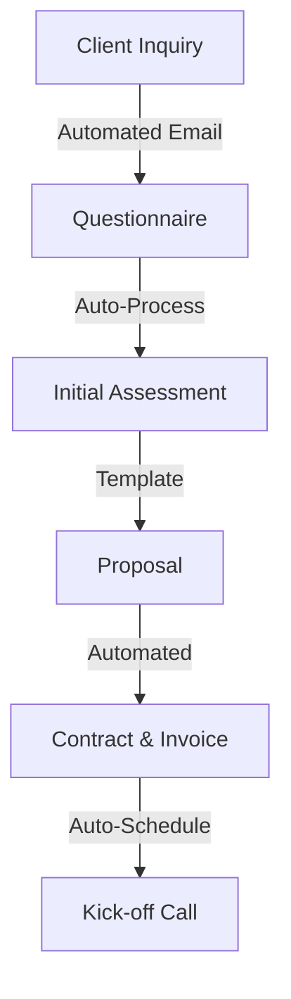
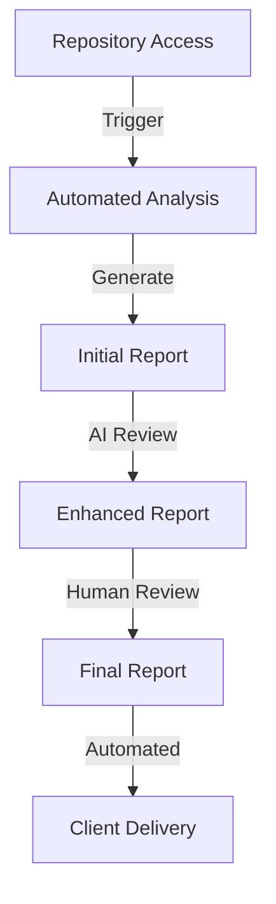
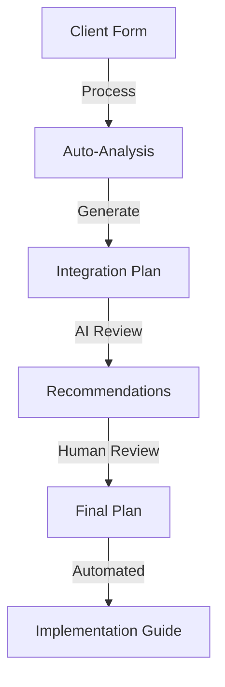

# Automated Solo Operation Plan

## Overview
This plan focuses on maximizing automation in our solo consulting practice, leveraging AI tools, MCP, and automated workflows to reduce manual work while maintaining quality. The goal remains generating $500-1000 monthly revenue with minimal active time investment.

## Automated Service Components

### 1. Automated Code Review Service ($150/hour)
- **Core Automation**:
  - AI-powered initial code analysis
  - Automated rule engine checks
  - Automated report generation
  - Security vulnerability scanning
  - Performance metric collection
  
- **Workflow**:
  1. Client submits code via GitHub repository
  2. Automated pipeline triggers:
     - Rule engine analysis
     - Security checks
     - Performance analysis
     - Documentation review
  3. AI generates initial report
  4. Human review for 30 minutes
  5. Final report delivery
  
- **Time Savings**: Reduce 4-hour review to 1 hour active time
- **Target Revenue**: Same $600-1200/month with 75% less active time

### 2. Semi-Automated MCP Integration Advisory ($200/hour)
- **Automated Components**:
  - Initial architecture analysis
  - Configuration validation
  - Security compliance checks
  - Performance testing
  - Documentation generation
  
- **Workflow**:
  1. Client fills online questionnaire
  2. Automated system generates:
     - Initial architecture recommendations
     - Security requirements
     - Integration checklist
  3. 30-minute human review
  4. Video call with client
  5. Automated follow-up system
  
- **Time Savings**: Reduce 2-hour consultation to 30 minutes active time
- **Target Revenue**: Same $400-800/month with 75% less active time

## Automated Infrastructure

### Core Automation Tools
1. **Code Analysis Pipeline**
   - GitHub Actions for automated analysis
   - Custom rule engine integration
   - Security scanning tools
   - Performance testing suite
   - Automated report generation

2. **Client Management System**
   - Automated scheduling (Calendly)
   - Automated invoicing (Stripe)
   - Email response templates
   - Follow-up automation
   - Client portal for submissions

3. **Documentation System**
   - Template-based generation
   - Automated formatting
   - Version control integration
   - Automated publishing
   - Client access management

4. **Marketing Automation**
   - Scheduled social media posts
   - Content distribution
   - Email newsletters
   - Lead tracking
   - Analytics collection

## Automated Workflows

### 1. Client Onboarding

### 2. Code Review Process

### 3. MCP Integration Process

## Time Investment (Weekly)

### Active Time (5 hours)
- Client Calls: 2 hours
- Report Reviews: 2 hours
- Strategy: 1 hour

### Automated Time (15+ hours equivalent)
- Code Analysis: 8 hours
- Report Generation: 4 hours
- Client Management: 2 hours
- Marketing: 1 hour

## Automation Development Plan

### Phase 1: Basic Automation (Month 1)
1. Set up GitHub Actions for code analysis
2. Configure basic rule engine
3. Create report templates
4. Implement scheduling system

### Phase 2: Enhanced Automation (Month 2)
1. Develop AI review integration
2. Create client portal
3. Automate invoicing
4. Set up marketing automation

### Phase 3: Full Automation (Month 3)
1. Implement advanced analytics
2. Create automated follow-ups
3. Develop performance testing
4. Build integration tools

## ROI Calculations

### Time Savings
- Manual Process: 17 hours/week
- Automated Process: 5 hours/week
- Time Saved: 12 hours/week (70% reduction)

### Revenue Impact
- Same revenue: $500-1000/month
- Reduced time investment
- Higher hourly effective rate
- Scalability potential

## Automation Metrics
- Process automation rate
- Response time
- Error reduction
- Client satisfaction
- Time savings

## Next Steps
1. [ ] Set up GitHub Actions pipeline
2. [ ] Configure rule engine automation
3. [ ] Create automated report system
4. [ ] Implement client portal
5. [ ] Set up marketing automation

## Tools & Integration

### Development Tools
- GitHub Actions
- Custom Rule Engine
- AI Analysis Tools
- Automated Testing

### Business Tools
- Calendly (Scheduling)
- Stripe (Payments)
- Zapier (Automation)
- MailChimp (Marketing)

### Communication
- Email Templates
- Automated Updates
- Client Portal
- Documentation Site

## Risk Mitigation

### Automation Risks
- Regular system monitoring
- Backup manual processes
- Quality control checks
- Error detection systems
- Human oversight points

### Quality Assurance
- Automated testing
- AI validation
- Human review points
- Client feedback loops
- Continuous improvement

## Contact & Systems
- **Client Portal**: [Portal URL]
- **Scheduling**: [Calendly Link]
- **Payments**: [Stripe Portal]
- **Support**: [Automated Ticket System]

---

*This plan leverages automation to maintain high-quality service delivery while minimizing active time investment.* 