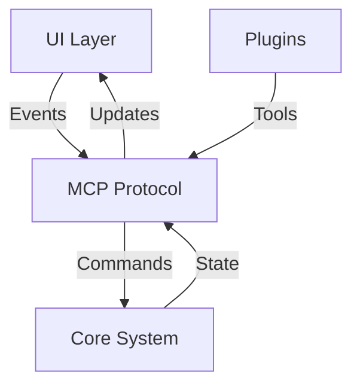

# Integration Overview

## Quick Start
- **Current Status**: 40% integrated across components
- **Priority Areas**: Core-MCP, UI Events, Security
- **Key Metrics**: [View Dashboard](../teamchat/metrics.md)

## What's Working
✅ UI Component Integration (64 passing tests)
✅ Basic MCP Protocol
✅ Core Command System

## What Needs Work
⚠️ Cross-Component Communication
⚠️ Error Handling
⚠️ Performance Monitoring

## Integration Points Map



## Team Focus Areas

### Core Team
- Command execution flow
- State management
- Error propagation

### UI Team
- Event handling
- State updates
- Progress tracking

### MCP Team
- Protocol management
- Tool lifecycle
- Security boundaries

## Current Challenges

### 1. State Management
- Sync issues between components
- Race conditions in updates
- Missing error recovery paths

### 2. Performance
- High latency in command execution
- Memory leaks in long operations
- Resource management needed

### 3. Security
- Token management incomplete
- Missing audit logging
- RBAC not implemented

## Next Steps

### Q2 2024 Goals
1. Complete Core-MCP integration (40% → 80%)
2. Implement error handling framework
3. Add performance monitoring

### Q3 2024 Goals
1. Security integration
2. State management improvements
3. Resource optimization

## Test Coverage Goals

| Component | Current | Target | Timeline |
|-----------|---------|---------|----------|
| Core-MCP  | 40%     | 80%     | Q2 2024  |
| UI-MCP    | 35%     | 75%     | Q2 2024  |
| Plugin    | 30%     | 70%     | Q3 2024  |

## Quick References

### Common Integration Patterns
```rust
// Event handling pattern
async fn handle_event(event: Event) -> Result<State> {
    // 1. Validate event
    // 2. Update state
    // 3. Notify subscribers
}

// State sync pattern
async fn sync_state(new_state: State) -> Result<()> {
    // 1. Lock state
    // 2. Apply updates
    // 3. Notify changes
}
```

### Testing Patterns
```rust
// Integration test pattern
#[tokio::test]
async fn test_component_flow() {
    // 1. Setup test context
    // 2. Run operation
    // 3. Verify state
    // 4. Check side effects
}
```

## Need Help?

- 🐛 Found a bug? [Report it](../teamchat/bugs.md)
- 🤔 Integration questions? [Ask in TeamChat](../teamchat/README.md)
- 📈 Performance issues? [Check metrics](../teamchat/metrics.md)

## For Humans
This is an AI-driven project, but this documentation is maintained for human oversight. Key points:

- We use semantic versioning
- Tests are your friends
- When in doubt, check the metrics
- TeamChat is your primary communication tool

Remember: The AI team handles the details, you handle the direction. 