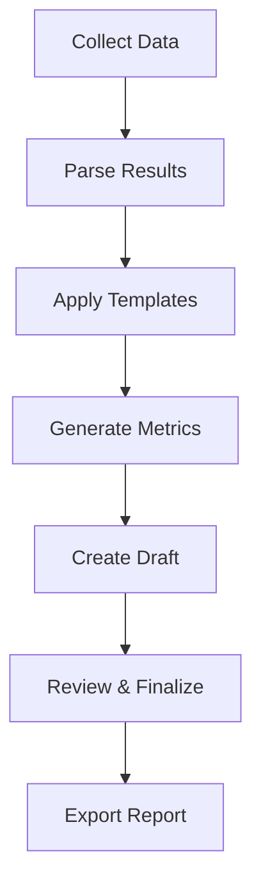
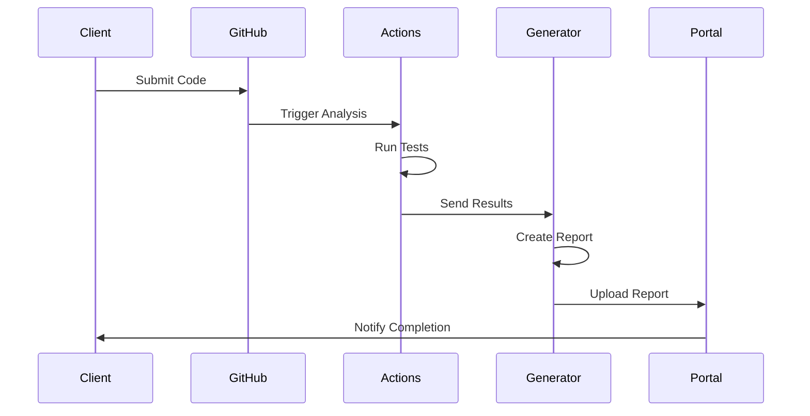
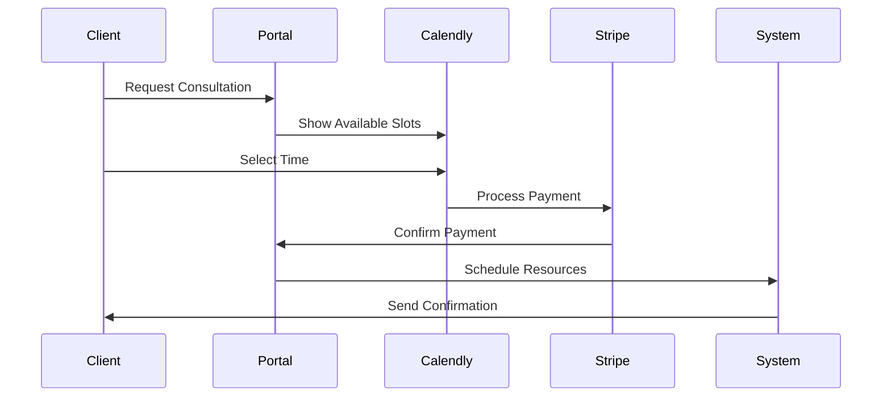

# Automation Infrastructure Specification

## GitHub Actions Pipeline

### Components
1. **Code Analysis Engine**
   ```yaml
   analysis:
     languages:
       - javascript
       - typescript
       - python
       - rust
     tools:
       - eslint
       - pylint
       - clippy
       - security-scanner
     output_format: json
   ```

2. **Security Scanning**
   ```yaml
   security:
     scanners:
       - codeql
       - dependency-check
       - sast
     severity_levels:
       - critical
       - high
       - medium
       - low
     report_format: sarif
   ```

3. **Performance Analysis**
   ```yaml
   performance:
     metrics:
       - time_complexity
       - space_complexity
       - memory_usage
       - cpu_usage
     benchmarks:
       - load_testing
       - stress_testing
     output_format: json
   ```

4. **Report Generation**
   ```yaml
   reporting:
     formats:
       - markdown
       - pdf
       - html
     sections:
       - executive_summary
       - technical_details
       - recommendations
       - metrics
     templating: jinja2
   ```

## Report Generator System

### Template Structure
```python
templates/
  ├── base/
  │   ├── header.md
  │   ├── footer.md
  │   └── metrics.md
  ├── code_review/
  │   ├── summary.md
  │   ├── analysis.md
  │   └── recommendations.md
  ├── security/
  │   ├── overview.md
  │   ├── findings.md
  │   └── mitigations.md
  └── consultation/
      ├── assessment.md
      ├── plan.md
      └── implementation.md
```

### Data Sources
```yaml
data_sources:
  - name: github_analysis
    type: json
    schema: analysis_schema.json
    required: true

  - name: security_scan
    type: sarif
    schema: security_schema.json
    required: true

  - name: performance_metrics
    type: json
    schema: performance_schema.json
    required: false

  - name: custom_notes
    type: markdown
    schema: notes_schema.json
    required: false
```

### Report Generation Pipeline


## Client Portal Integration

### Authentication Flow
```yaml
auth:
  provider: auth0
  methods:
    - email_password
    - github_oauth
    - google_oauth
  mfa:
    required: true
    methods:
      - authenticator_app
      - sms
```

### Service Integration
```yaml
services:
  calendly:
    webhook_events:
      - invitee.created
      - invitee.canceled
    automation:
      - send_confirmation_email
      - create_meeting_notes
      - schedule_reminders

  stripe:
    payment_methods:
      - card
      - bank_transfer
    webhooks:
      - payment.succeeded
      - payment.failed
    automation:
      - generate_invoice
      - send_receipt
      - update_subscription

  github:
    webhook_events:
      - push
      - pull_request
      - repository
    automation:
      - trigger_analysis
      - update_status
      - notify_client
```

## Data Flow

### Analysis Pipeline


### Consultation Flow


## Security Measures

### Data Protection
```yaml
encryption:
  at_rest:
    algorithm: AES-256
    key_management: aws_kms
  in_transit:
    protocol: TLS 1.3
    cert_provider: lets_encrypt

access_control:
  rbac:
    roles:
      - admin
      - client
      - reviewer
    permissions:
      - read
      - write
      - execute
```

### Monitoring
```yaml
monitoring:
  metrics:
    - system_health
    - response_time
    - error_rate
    - user_activity
  alerts:
    - service_down
    - high_latency
    - security_breach
    - payment_failure
```

## Deployment Requirements

### Infrastructure
```yaml
requirements:
  compute:
    type: serverless
    provider: aws_lambda
    memory: 1024MB
    timeout: 300s

  storage:
    type: object_store
    provider: aws_s3
    encryption: true
    lifecycle_rules: true

  database:
    type: document_store
    provider: mongodb_atlas
    backup: daily
    retention: 30d
```

### Scaling
```yaml
scaling:
  auto_scaling:
    min_instances: 1
    max_instances: 5
    target_cpu_utilization: 70%

  rate_limiting:
    requests_per_second: 10
    burst: 20
    throttling: true
```

## Error Handling

### Recovery Procedures
```yaml
error_handling:
  retry:
    max_attempts: 3
    backoff:
      initial: 1s
      multiplier: 2
      max: 8s

  fallback:
    - local_cache
    - degraded_mode
    - manual_intervention

  notification:
    channels:
      - email
      - slack
      - sms
    priority_levels:
      - critical
      - high
      - medium
      - low
``` 