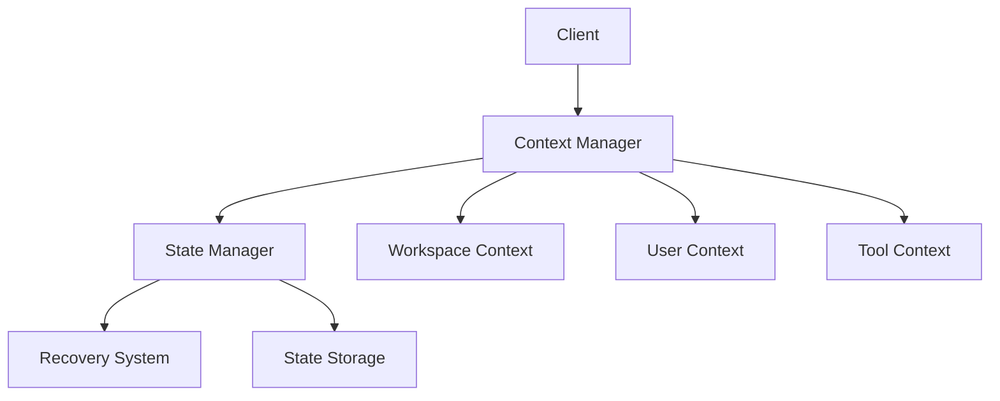

# Context Management System Overview

## System Architecture

The Context Management System is responsible for maintaining and synchronizing the development environment's state and context. It consists of two main components:

### 1. Context Manager
Handles the active context of the development environment:

- **Workspace Context**
  - File system state
  - Active files
  - Editor state
  - Environment variables

- **User Context**
  - User preferences
  - Session information
  - Recent actions
  - Permissions

- **Tool Context**
  - Available tools
  - Tool states
  - Execution history
  - Capabilities

### 2. State Manager
Manages persistent state and recovery:

- **State Management**
  - State registration
  - State transitions
  - State persistence
  - State validation

- **Recovery System**
  - Recovery points
  - State restoration
  - History management
  - Integrity checks

## System Interaction

## Core Features

### Context Management
- Real-time context updates
- Context validation
- Event notification
- Context synchronization

### State Management
- Persistent state storage
- State transition management
- Recovery mechanisms
- State validation

## Integration Points

### 1. MCP Integration
- Context-aware message handling
- State-aware tool execution
- Security context integration
- Event propagation

### 2. IDE Integration
- Editor state synchronization
- File system monitoring
- Tool integration
- User interaction

## Best Practices

1. **Context Updates**
   - Atomic operations
   - Event-driven updates
   - Proper validation
   - Error handling

2. **State Management**
   - Regular state saves
   - Clean recovery points
   - Efficient storage
   - Performance monitoring

3. **Security**
   - Context validation
   - Access control
   - Secure storage
   - Audit logging

## Version History

- 1.0.0: Initial context system overview
  - Defined system architecture
  - Established core features
  - Documented integration points
  - Outlined best practices

<version>1.0.0</version> 