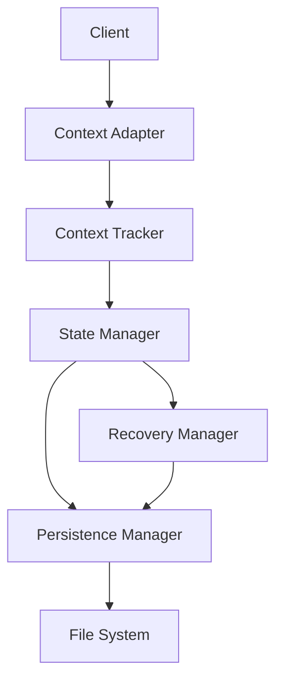

# Context Management System Overview

## System Architecture

The Context Management System is responsible for maintaining and synchronizing the development environment's state and context. It consists of several key components that work together to provide a robust foundation for context-aware operations.

### 1. Context System
The core context system manages state representation and tracking:

- **Context State**
  - Versioned state data
  - Update timestamps
  - Serialized content

- **Context Tracker**
  - State tracking
  - Version management
  - Thread-safe access

- **Context Factory**
  - Dependency injection
  - Configurable creation
  - Component composition

### 2. State Management
Handles state persistence and recovery:

- **State Manager**
  - State transitions
  - State validation
  - Repository integration

- **State Repository**
  - State storage
  - State retrieval
  - Snapshot management

- **Persistence Manager**
  - File system operations
  - Atomic state updates
  - Snapshot management

### 3. Recovery System
Manages state recovery and snapshot management:

- **Recovery Manager**
  - Recovery points
  - State restoration
  - Snapshot rotation
  - Integrity verification

### 4. Context Adapter
Connects the context system to other components:

- **Context Adapter**
  - Protocol translation
  - Integration support
  - Specialized context handling
  - Configuration management

## System Interaction

## Core Features

### Context Management
- Thread-safe state tracking
- Version-based conflict resolution
- Atomic state updates
- Context lifecycle management

### State Management
- Persistent state storage
- State versioning
- Recovery mechanisms
- State validation

### Recovery System
- Snapshot creation and management
- Point-in-time recovery
- Automatic snapshot rotation
- Integrity validation

### Context Adapter
- Clean separation of concerns
- Protocol-specific adaptation
- Integration support
- Configuration management

## Integration Points

### 1. MCP Integration
- MCP-specific context adapter
- Context-aware message handling
- Tool state tracking
- Event propagation

### 2. Command System Integration
- Context-aware command execution
- State tracking for commands
- Error recovery integration
- Context validation

## Implementation Details

### 1. Thread Safety
- Uses `Arc<Mutex<>>` for state protection
- Implements proper locking strategy
- Handles concurrent access

### 2. Error Handling
- Comprehensive error types
- Proper error propagation
- Recovery mechanisms
- Clear error messages

### 3. Asynchronous Programming
- Async/await for I/O operations
- Tokio runtime integration
- Proper cancellation handling
- Concurrent operation support

### 4. Serialization
- Efficient state serialization
- Binary format for state data
- JSON for human-readable parts
- Version tracking for compatibility

## Best Practices

1. **Context Updates**
   - Use atomic operations
   - Track versions
   - Validate state changes
   - Handle errors gracefully

2. **State Management**
   - Persist state regularly
   - Create recovery points
   - Use efficient storage
   - Monitor performance

3. **Recovery**
   - Create regular snapshots
   - Implement rotation policies
   - Validate before recovery
   - Test recovery paths

4. **Integration**
   - Use the adapter pattern
   - Maintain separation of concerns
   - Document integration points
   - Test cross-component interaction

## Version History

- 1.0.0: Initial context system overview
  - Defined system architecture
  - Established core features
  - Documented integration points
  - Outlined best practices

- 1.1.0: Updated to align with implementation
  - Refined component architecture
  - Updated integration details
  - Added implementation details
  - Clarified component relationships

<version>1.1.0</version> 