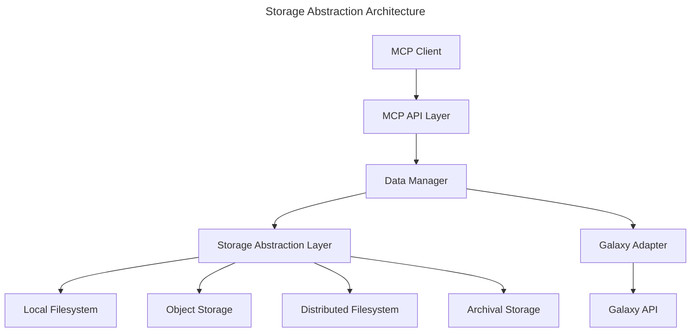
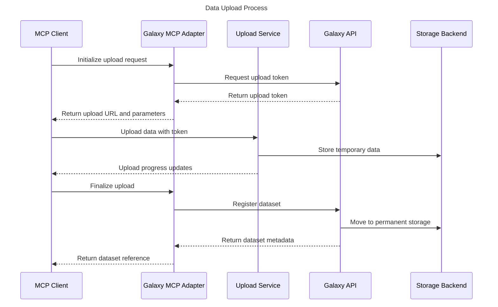
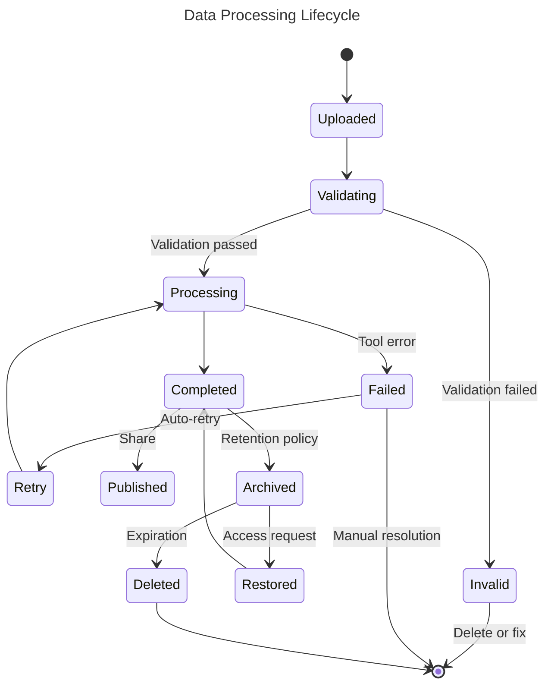
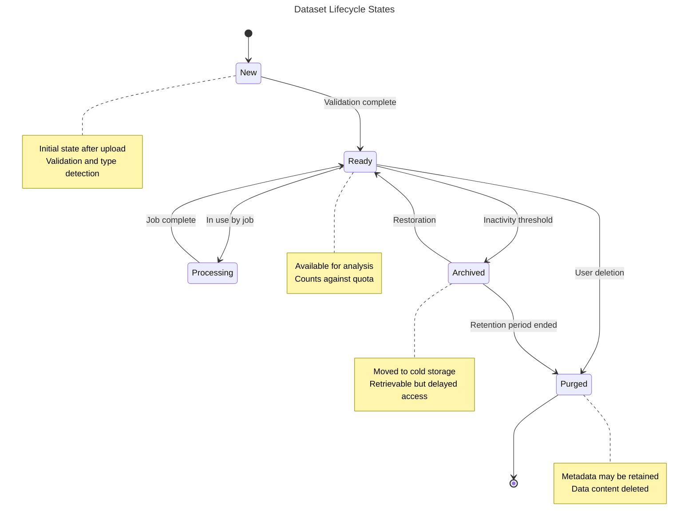
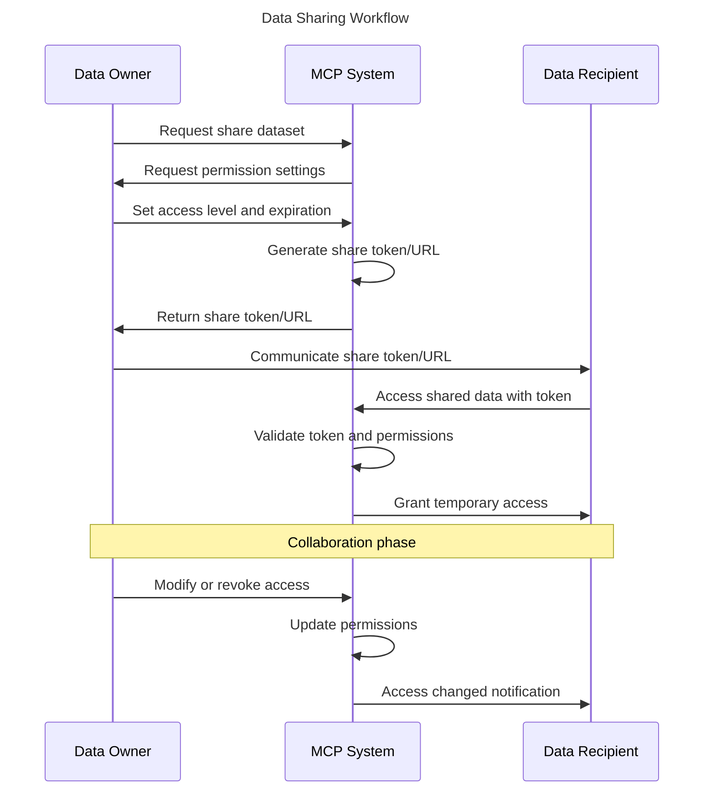
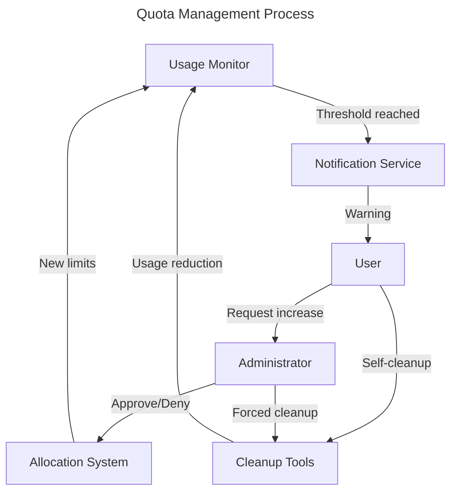
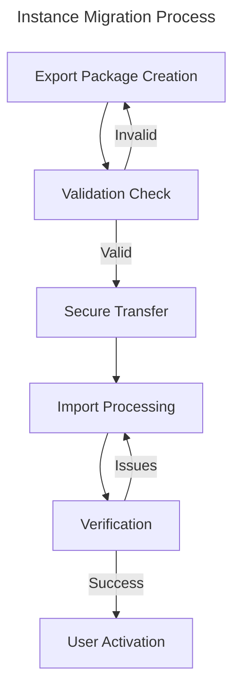

# Galaxy MCP Adapter Data Management

## 1. Overview

This specification defines how the Galaxy MCP adapter crate manages data between the MCP application and Galaxy. It covers data representations, transfer mechanisms, conversion utilities, and lifecycle management to provide efficient and secure data handling as part of the adapter crate implementation.

The adapter leverages existing data handling capabilities in the MCP and context crates while providing Galaxy-specific extensions for bioinformatics data types.

## 2. Data Models and Representations

### 2.1 Core Data Entities

The adapter maps between MCP data models and Galaxy data entities:

| Entity | Description | MCP Representation | Galaxy Representation | Adapter Mapping |
|--------|-------------|-------------------|----------------------|-----------------|
| Dataset | Single data file | Resource object with metadata | Galaxy Dataset | `GalaxyDataset` struct |
| Collection | Group of related datasets | Collection resource with child references | Galaxy DatasetCollection | `GalaxyCollection` struct |
| History | Container for analysis results | Container resource | Galaxy History | `GalaxyHistory` struct |
| Library | Shared data repository | Repository resource | Galaxy Library | `GalaxyLibrary` struct |
| Job | Data processing task | Task resource | Galaxy Job | `GalaxyJob` struct |

### 2.2 Data Reference Model

```rust
/// Represents a reference to a Galaxy dataset
#[derive(Debug, Clone, Serialize, Deserialize)]
pub enum GalaxyDataReference {
    /// Reference to a dataset by ID
    DatasetId(String),
    
    /// Reference to a dataset by History and position
    HistoryDataset {
        history_id: String,
        position: usize,
    },
    
    /// Reference to a dataset collection element
    CollectionElement {
        collection_id: String,
        element_identifier: String,
    },
    
    /// Reference to a library dataset
    LibraryDataset {
        library_id: String,
        folder_id: String,
        name: String,
    },
}

impl GalaxyDataReference {
    /// Resolve this reference to an actual Galaxy dataset ID
    pub async fn resolve(&self, adapter: &GalaxyAdapter) -> Result<String, Error> {
        match self {
            Self::DatasetId(id) => Ok(id.clone()),
            Self::HistoryDataset { history_id, position } => {
                adapter.get_history_dataset_id(history_id, *position).await
            },
            Self::CollectionElement { collection_id, element_identifier } => {
                adapter.get_collection_element_id(collection_id, element_identifier).await
            },
            Self::LibraryDataset { library_id, folder_id, name } => {
                adapter.get_library_dataset_id(library_id, folder_id, name).await
            },
        }
    }
}
```

### 2.3 Dataset Metadata

```rust
/// Metadata for Galaxy datasets
#[derive(Debug, Clone, Serialize, Deserialize, Default)]
pub struct DatasetMetadata {
    /// Dataset name
    pub name: String,
    
    /// Dataset format/type (e.g., "fastq", "bam")
    pub format: String,
    
    /// Dataset size in bytes
    pub size: Option<usize>,
    
    /// Creation timestamp
    pub created: Option<String>,
    
    /// Tags associated with the dataset
    pub tags: Vec<String>,
    
    /// Database ID
    pub id: Option<String>,
    
    /// Format-specific metadata fields
    pub format_metadata: HashMap<String, serde_json::Value>,
}
```

### 2.4 Data Type System

The adapter supports Galaxy's data types with appropriate Rust representations:

```rust
/// Galaxy data type representations
pub enum GalaxyDataType {
    /// Text file data
    Text(String),
    
    /// Binary file data
    Binary(Vec<u8>),
    
    /// JSON data
    Json(serde_json::Value),
    
    /// Tabular data
    Tabular(Vec<Vec<String>>),
    
    /// FASTA sequence data
    Fasta(Vec<FastaRecord>),
    
    /// FASTQ sequence data
    Fastq(Vec<FastqRecord>),
    
    /// BAM alignment data (reference only, not loaded in memory)
    Bam(GalaxyDataReference),
    
    /// VCF variant data
    Vcf(GalaxyDataReference),
    
    /// Reference to a file that's too large to load in memory
    FileReference {
        reference: GalaxyDataReference,
        format: String,
    },
}

/// Conversions between data types
impl GalaxyDataType {
    /// Try to convert to text representation
    pub fn as_text(&self) -> Result<String, Error> {
        match self {
            Self::Text(text) => Ok(text.clone()),
            Self::Json(json) => Ok(json.to_string()),
            Self::Tabular(rows) => {
                let mut result = String::new();
                for row in rows {
                    result.push_str(&row.join("\t"));
                    result.push('\n');
                }
                Ok(result)
            },
            Self::Fasta(records) => {
                let mut result = String::new();
                for record in records {
                    result.push_str(&format!(">{}\n{}\n", record.header, record.sequence));
                }
                Ok(result)
            },
            _ => Err(Error::UnsupportedConversion("Cannot convert to text".into())),
        }
    }
    
    /// Get data size estimate
    pub fn size_estimate(&self) -> usize {
        match self {
            Self::Text(text) => text.len(),
            Self::Binary(data) => data.len(),
            Self::Json(json) => json.to_string().len(),
            Self::Tabular(rows) => rows.iter().map(|row| row.join("\t").len() + 1).sum(),
            Self::Fasta(records) => records.iter().map(|r| r.header.len() + r.sequence.len() + 2).sum(),
            Self::Fastq(records) => records.iter().map(|r| r.id.len() + r.sequence.len() + r.quality.len() + 4).sum(),
            _ => 0, // Size unknown for references
        }
    }
}
```

## 3. Data Storage Architecture

### 3.1 Storage Backends

Multiple storage backends are supported with unified access interface:

| Backend | Use Case | Performance Characteristics | Cost Efficiency |
|---------|----------|----------------------------|----------------|
| Local Filesystem | Development, small deployments | Fast access, limited scale | Low upfront, high at scale |
| Object Storage | Production default | Scalable, moderate latency | Cost-effective at scale |
| Distributed Filesystem | HPC environments | High throughput, low latency | High upfront, efficient for large files |
| Hierarchical Storage | Archival data | Tiered performance | Optimized for cold data |

### 3.2 Storage Abstraction Layer



### 3.3 Data Locality Strategy

Optimizing data placement for processing efficiency:

| Scenario | Locality Strategy | Benefits |
|----------|-------------------|----------|
| Interactive Analysis | Cache frequently accessed data | Reduced latency |
| Batch Processing | Co-locate data and compute | Reduced data movement |
| Shared Analysis | Centralized shared storage | Consistent access |
| Multi-region | Geo-distributed replication | Regional access performance |

## 4. Data Transfer Mechanisms

### 4.1 Upload Protocols

| Protocol | Use Case | Performance | Client Support |
|----------|----------|-------------|---------------|
| HTTP/S | Standard uploads | Moderate | Universal |
| FTP | Large files | Good | Widely supported |
| Resumable Upload API | Unreliable connections | Very good | Library required |
| Cloud Storage Direct | Cloud-hosted data | Excellent | Platform-specific |

### 4.2 Upload Workflow



### 4.3 Download Protocols

| Protocol | Use Case | Performance | Features |
|----------|----------|-------------|----------|
| HTTP/S | Standard downloads | Moderate | Universal |
| FTP | Large files | Good | Resume capability |
| Streaming API | Real-time processing | Very good | No local storage required |
| Byte Range Requests | Partial file access | Excellent | Specific region retrieval |

### 4.4 Batch Transfer Optimizations

For transferring multiple datasets:

1. **Transfer Bundling**: Group small files into single transfer
2. **Parallel Transfers**: Multiple simultaneous connections
3. **Delta Transfers**: Only transmit changed portions
4. **Compression**: Content-specific compression algorithms
5. **Checksumming**: Verify data integrity efficiently

## 5. Data Processing Pipeline

### 5.1 Processing Flow



### 5.2 Job Data Management

For each processing job, data is handled as follows:

1. **Input Preparation**: Link or copy input datasets
2. **Intermediate Data**: Temporary working directory
3. **Output Collection**: Registration of output datasets
4. **Job Cleanup**: Removal of intermediate files
5. **Provenance Capture**: Record of inputs, parameters, and tools

### 5.3 Execution-Time Data Handling

Special considerations for data during execution:

| Scenario | Handling Strategy |
|----------|-------------------|
| Large Inputs | Streaming access without full download |
| Reference Data | Pre-mounted shared filesystems |
| Memory Constraints | Disk-based processing algorithms |
| Intermediate Files | Automatic cleanup with retention rules |

## 6. Data Lifecycle Management

### 6.1 Lifecycle States



### 6.2 Retention Policies

| Data Category | Default Retention | Storage Tier | Archival Strategy |
|---------------|-------------------|--------------|-------------------|
| Raw Data | 2 years | Standard | Archive after 90 days inactivity |
| Intermediate Results | 90 days | Standard | Delete after inactivity |
| Analysis Results | 1 year | Standard | Archive after 60 days inactivity |
| Published Data | 5 years | Standard + Backup | Archive after 1 year inactivity |
| Reference Data | Indefinite | Optimized | Never automatically deleted |

### 6.3 Policy Implementation

```python
# Example retention policy implementation
def apply_retention_policy(dataset, current_date):
    """Apply retention policy based on dataset category and state."""
    category = dataset.metadata.get("retention_category", "default")
    last_accessed = dataset.access_log.latest()
    owner_active = is_user_active(dataset.owner, days=90)
    
    # Define policy parameters
    policies = {
        "raw_data": {
            "inactivity_threshold": timedelta(days=90),
            "archive_after": timedelta(days=90),
            "retain_until": dataset.created + timedelta(days=365*2),
        },
        "intermediate": {
            "inactivity_threshold": timedelta(days=30),
            "archive_after": None,  # No archival, direct deletion
            "retain_until": dataset.created + timedelta(days=90),
        },
        # ... other categories
    }
    
    policy = policies.get(category, policies["default"])
    
    # Calculate inactivity
    inactivity_period = current_date - last_accessed
    
    # Apply policy
    if current_date > policy["retain_until"]:
        return "purge"
    elif policy["archive_after"] and inactivity_period > policy["archive_after"]:
        return "archive"
    elif not owner_active and inactivity_period > policy["inactivity_threshold"]:
        return "archive"
    else:
        return "maintain"
```

### 6.4 Data Recovery

Methods for recovering deleted or archived data:

1. **Short-term Recovery**: 30-day soft deletion period
2. **Archived Data Retrieval**: Self-service portal with delay notification
3. **Administrative Recovery**: Support request for special cases
4. **Backup Restoration**: For system failures or corruption
5. **Permanent Deletion**: Compliance with deletion requests

## 7. Data Security and Privacy

### 7.1 Data Classification

| Classification | Description | Security Requirements | Example Data |
|----------------|-------------|----------------------|--------------|
| Public | Openly available | Basic integrity controls | Published results |
| Internal | Organization-wide access | Access authentication | Works in progress |
| Confidential | Restricted access | Encryption, access control | Proprietary analyses |
| Sensitive | Highly restricted | Full encryption, audit trails | Identifiable samples |
| Regulated | Compliance requirements | Comprehensive controls | Clinical data |

### 7.2 Data Protection Mechanisms

Security controls applied to data at each stage:

| Stage | Protection Mechanism |
|-------|----------------------|
| Storage | Encryption at rest (AES-256) |
| Transfer | TLS 1.3, secure tokens |
| Processing | Isolated execution environments |
| Backup | Encrypted snapshots |
| Access | Multi-factor authentication, fine-grained permissions |

### 7.3 Privacy Controls

For handling sensitive or personal data:

1. **Data Minimization**: Only collect necessary data
2. **Anonymization Pipeline**: Remove identifiers before analysis
3. **Consent Tracking**: Record and enforce usage limitations
4. **Access Logging**: Comprehensive audit trail
5. **Data Subject Rights**: Processes for access, correction, deletion

### 7.4 Security Implementation

Example access control implementation:

```rust
/// Validates a user's access to a dataset
pub async fn validate_dataset_access(
    user_id: &str,
    dataset_id: &str,
    requested_access: AccessLevel,
) -> Result<bool, SecurityError> {
    // Retrieve dataset metadata
    let dataset = dataset_service.get_dataset(dataset_id).await?;
    
    // Check direct ownership
    if dataset.owner_id == user_id {
        return Ok(true);
    }
    
    // Check shared access
    let permissions = permission_service.get_user_permissions(user_id, dataset_id).await?;
    if permissions.access_level >= requested_access {
        return Ok(true);
    }
    
    // Check group memberships
    let user_groups = group_service.get_user_groups(user_id).await?;
    for group_id in dataset.shared_with_groups {
        if user_groups.contains(&group_id) {
            let group_perms = permission_service
                .get_group_permissions(group_id, dataset_id)
                .await?;
            if group_perms.access_level >= requested_access {
                return Ok(true);
            }
        }
    }
    
    // No sufficient access found
    log_access_attempt(user_id, dataset_id, requested_access, false).await;
    Ok(false)
}
```

## 8. Data Transfer and Transformation

### 8.1 Format Conversions

Support for automatic conversions between formats:

| Source Format | Target Format | Transformation | Quality Impact |
|---------------|---------------|----------------|---------------|
| FASTQ | FASTA | Drop quality scores | Lossy |
| BAM | SAM | Format unpacking | Lossless |
| VCF | BCF | Binary conversion | Lossless |
| BAM | CRAM | Reference-based compression | Near-lossless |
| CSV | TSV | Delimiter conversion | Lossless |

### 8.2 Content Transformation

Data-modifying transformations available:

1. **Filtering**: Remove entries meeting criteria
2. **Subsetting**: Extract specific regions or columns
3. **Aggregation**: Combine multiple entries
4. **Normalization**: Standardize content format
5. **Anonymization**: Remove identifying information

### 8.3 Bulk Operations

For operating on large collections of datasets:

```
# Example bulk copy operation via MCP messaging
REQUEST:
{
  "header": {
    "messageId": "msg-12345",
    "timestamp": "2025-02-15T08:30:00Z",
    "messageType": "request"
  },
  "payload": {
    "operation": "bulk_copy",
    "source": {
      "type": "collection",
      "id": "collection-abc123"
    },
    "destination": {
      "type": "history",
      "id": "history-def456"
    },
    "options": {
      "includeHidden": false,
      "createNewCollection": true,
      "newCollectionName": "Analysis Inputs"
    }
  }
}

RESPONSE:
{
  "header": {
    "messageId": "msg-67890",
    "correlationId": "msg-12345",
    "timestamp": "2025-02-15T08:30:05Z",
    "messageType": "response"
  },
  "payload": {
    "status": "success",
    "operation": "bulk_copy",
    "jobId": "job-xyz789",
    "summary": {
      "totalItems": 25,
      "copied": 25,
      "failed": 0,
      "newCollection": "collection-ghi789"
    }
  }
}
```

## 9. Data Sharing and Collaboration

### 9.1 Sharing Models

| Sharing Level | Access Scope | Implementation |
|---------------|--------------|----------------|
| User-to-User | Direct sharing | Explicit access grants |
| Group-based | Team collaboration | Role-based permissions |
| Organization | Internal sharing | Domain-based access |
| Public | Open access | Publishing workflow |

### 9.2 Collaboration Workflows



### 9.3 Permissions Model

Granular permissions for shared data:

| Permission | Description | Example |
|------------|-------------|---------|
| View | Read-only access | View analysis results |
| Use | Reference in jobs | Use dataset as tool input |
| Copy | Create duplicates | Add to own history |
| Edit | Modify content/metadata | Rename, tag, annotate |
| Share | Grant access to others | Share with collaborators |
| Delete | Remove dataset | Delete contributed datasets |
| Administer | Full control | Manage all permissions |

### 9.4 Data Publishing

For making datasets publicly available:

1. **Publication Preparation**: Validation and metadata completion
2. **Access Type Selection**: Open, registered, controlled
3. **License Assignment**: Data usage license (e.g., CC-BY)
4. **Repository Selection**: Internal or external repositories
5. **DOI Assignment**: Persistent identifier registration
6. **Discoverability**: Indexing and search optimization

## 10. Data Import/Export

### 10.1 Bulk Import Mechanisms

Methods for importing existing datasets:

| Import Source | Mechanism | Metadata Handling |
|---------------|-----------|-------------------|
| Local Files | Directory scan and upload | Extracted from files |
| Remote URLs | Fetcher service | Source reference |
| Cloud Storage | Direct connector | Cloud metadata mapping |
| External Repositories | API integration | Cross-reference mapping |
| Other Galaxy Instances | Server-to-server transfer | Full metadata transfer |

### 10.2 Export Formats

Supported formats for exporting data:

| Format | Use Case | Metadata Inclusion |
|--------|----------|-------------------|
| Raw Files | Direct use in tools | None |
| ZIP/TAR Archive | Bundled datasets | Basic manifest |
| BagIt | Preservation-ready export | Full metadata |
| Galaxy History | Complete analysis record | Full provenance |
| Workflow Invocation | Reproducible workflow | Parameters and inputs |

### 10.3 Metadata Standards

Support for exchanging metadata with external systems:

1. **Dublin Core**: Basic bibliographic metadata
2. **ISA-Tab**: Investigation-Study-Assay information
3. **DCAT**: Data Catalog Vocabulary
4. **Schema.org**: General web metadata
5. **Domain-specific**: MIAME, MINSEQE, etc.

## 11. Quota and Resource Management

### 11.1 Storage Quota System

| Quota Type | Scope | Enforcement |
|------------|-------|-------------|
| User Quota | Per-user storage limit | Blocking on exceed |
| Group Quota | Shared team allocation | Warning on threshold |
| Project Quota | Task-based allocation | Administrative approval |
| Dataset Size | Individual file limit | Upload restriction |
| Collection Size | Collection item limit | Creation restriction |

### 11.2 Quota Management

Administrative and user-facing quota tools:



### 11.3 Resource Optimization

Strategies for minimizing storage usage:

1. **Deduplication**: Identify and link identical datasets
2. **Compression**: Format-specific compression algorithms
3. **Indexing**: Efficient access to subsets without full storage
4. **Reference-based Storage**: Delta storage for similar files
5. **Tiered Storage**: Move infrequently accessed data to lower-cost storage

## 12. Monitoring and Analytics

### 12.1 Data Monitoring Metrics

Key metrics for monitoring data subsystem health:

| Metric | Description | Alert Threshold |
|--------|-------------|----------------|
| Storage Utilization | Overall and per-backend | 80% |
| Access Patterns | Read/write frequency | Significant change |
| Error Rates | Failed operations | >1% |
| Transfer Performance | Throughput and latency | <50% of baseline |
| Quota Status | Users approaching limits | 90% |
| Data Growth | Rate of increase | >20% monthly |

### 12.2 Usage Analytics

Insights gathered from data usage patterns:

1. **Popular Datasets**: Most frequently accessed
2. **Usage Patterns**: Temporal access patterns
3. **Collaboration Networks**: Sharing relationships
4. **Tool Association**: Datasets used with specific tools
5. **Storage Distribution**: Usage by category and type

### 12.3 Observability Implementation

```yaml
# Prometheus monitoring configuration example
scrape_configs:
  - job_name: 'galaxy_mcp_data'
    scrape_interval: 15s
    static_configs:
      - targets: ['data-service:9090']
    metrics_path: '/metrics'

# Example metrics exposed
galaxy_mcp_data_storage_bytes_total{backend="object_store",state="active"} 1235000000
galaxy_mcp_data_storage_bytes_total{backend="object_store",state="archived"} 5678000000
galaxy_mcp_data_operations_total{operation="upload",status="success"} 12350
galaxy_mcp_data_operations_total{operation="upload",status="error"} 123
galaxy_mcp_data_transfer_bytes_total{direction="in"} 45678000000
galaxy_mcp_data_transfer_bytes_total{direction="out"} 23456000000
galaxy_mcp_data_access_latency_seconds{backend="object_store",operation="read"} 0.236
```

## 13. Implementation Requirements

### 13.1 Data Service Interface

Core interfaces for implementing the data management service:

```rust
/// Core data service interface
pub trait DataService {
    /// Store a new dataset
    async fn store_dataset(
        &self,
        content: impl AsyncRead,
        metadata: DatasetMetadata,
    ) -> Result<DatasetId, DataError>;
    
    /// Retrieve dataset content
    async fn retrieve_dataset(
        &self,
        id: &DatasetId,
        range: Option<ByteRange>,
    ) -> Result<impl AsyncRead, DataError>;
    
    /// Update dataset metadata
    async fn update_metadata(
        &self,
        id: &DatasetId,
        metadata: DatasetMetadata,
    ) -> Result<(), DataError>;
    
    /// Delete a dataset
    async fn delete_dataset(&self, id: &DatasetId) -> Result<(), DataError>;
    
    /// List datasets matching criteria
    async fn list_datasets(
        &self,
        filter: DatasetFilter,
        pagination: Pagination,
    ) -> Result<Vec<DatasetMetadata>, DataError>;
    
    /// Move dataset between storage tiers
    async fn change_storage_tier(
        &self,
        id: &DatasetId,
        tier: StorageTier,
    ) -> Result<(), DataError>;
}

/// Storage backend interface
pub trait StorageBackend {
    /// Store object data
    async fn put_object(
        &self,
        key: &str,
        content: impl AsyncRead,
        size_hint: Option<u64>,
        metadata: HashMap<String, String>,
    ) -> Result<(), StorageError>;
    
    /// Retrieve object data
    async fn get_object(
        &self,
        key: &str,
        range: Option<ByteRange>,
    ) -> Result<impl AsyncRead, StorageError>;
    
    /// Check if object exists
    async fn object_exists(&self, key: &str) -> Result<bool, StorageError>;
    
    /// Delete object
    async fn delete_object(&self, key: &str) -> Result<(), StorageError>;
    
    /// Get object metadata
    async fn get_metadata(&self, key: &str) -> Result<HashMap<String, String>, StorageError>;
}
```

### 13.2 Galaxy Integration

For integrating with Galaxy's data management:

1. **Dataset Mapping**: Two-way ID mapping between systems
2. **Permission Synchronization**: Maintain consistent permissions
3. **History Integration**: Map MCP containers to Galaxy histories
4. **Library Connection**: Support for Galaxy data libraries
5. **Job Data Flow**: Handle job input/output dataset connections

### 13.3 Performance Requirements

| Operation | Latency Target | Throughput Target | Reliability |
|-----------|----------------|-------------------|------------|
| Upload (small file) | <2s | >10 files/s | 99.9% |
| Upload (large file) | <30s per GB | >100 MB/s | 99.9% |
| Download | <1s + transfer time | >200 MB/s | 99.95% |
| Metadata Operations | <100ms | >100 ops/s | 99.99% |
| Search/List | <500ms | >20 queries/s | 99.9% |

## 14. Data Migration and Portability

### 14.1 Data Migration Strategies

Approaches for moving data between instances:

| Migration Type | Strategy | Downtime Required |
|----------------|----------|-------------------|
| Same-version | Direct storage copy | Minimal |
| Cross-version | Export/import with translation | Moderate |
| Incremental | Delta-based synchronization | None |
| Storage Backend | Backend-specific transfer tools | Variable |

### 14.2 Instance-to-Instance Migration

Process for migrating between Galaxy MCP instances:



### 14.3 External Tool Compatibility

Support for exchanging data with external tools:

1. **Standard Formats**: Use widely-supported data formats
2. **Metadata Preservation**: Retain essential context
3. **Batch Export Tools**: Efficiently prepare data for external use
4. **Re-import Capability**: Allow processed data to return with provenance
5. **API Access**: Direct programmatic access to datasets

## 15. Related Specifications

- [Galaxy MCP Integration Plan](galaxy-mcp-integration.md)
- [API Mapping](api-mapping.md)
- [Security Model](security-model.md)
- [Workflow Management](workflow-management.md)
- [Configuration Management](configuration-management.md)
- [Deployment Guide](deployment-guide.md)

<version>0.1.0</version> 