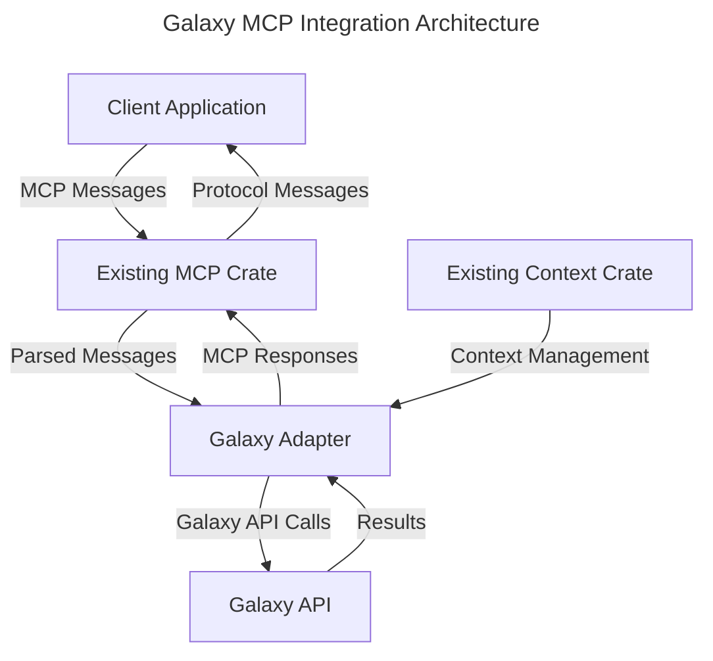

# Galaxy MCP Integration

## 1. Overview

This specification defines the architectural approach for integrating the Galaxy bioinformatics platform with the Machine Context Protocol (MCP). The integration enables AI assistants to discover, execute, and orchestrate Galaxy's bioinformatics tools through a standardized protocol.

## 2. Implementation Strategy

### 2.1 Integration Approach

Rather than building a standalone system, this integration will leverage existing MCP and context crates from the Squirrel MCP project. This approach offers several key advantages:

1. **Reduced Development Effort**: By reusing existing components, development time and effort are significantly reduced.
2. **Proven Foundation**: The existing MCP and context crates provide a proven foundation for handling protocol communication and context management.
3. **Consistency**: Using the same core libraries ensures consistent behavior across different tool integrations.
4. **Maintainability**: Centralizing core protocol logic reduces maintenance burden when the protocol evolves.

### 2.2 Component Architecture



### 2.3 Integration Structure

The integration will be implemented as a Rust crate within the existing project structure:

```
project/
├── Cargo.toml (workspace)
├── crates/
│   ├── mcp/              # Existing MCP protocol implementation
│   ├── context/          # Existing context management
│   └── galaxy-mcp/       # New Galaxy adapter crate
└── examples/
    └── galaxy-workflow/  # Example workflows using Galaxy
```

## 3. Key Components

### 3.1 Galaxy Adapter

The Galaxy adapter serves as the bridge between the MCP protocol and the Galaxy API:

```rust
pub struct GalaxyAdapter {
    mcp: mcp::Protocol,
    context: context::Manager,
    galaxy_client: GalaxyClient,
    config: GalaxyConfig,
}

impl GalaxyAdapter {
    pub fn new(config: GalaxyConfig) -> Self {
        // Initialize adapter with existing MCP and context components
    }
    
    pub async fn handle_message(&self, message: mcp::Message) -> Result<mcp::Message, Error> {
        // Process incoming MCP messages using existing MCP crate
        // Translate to Galaxy API calls
        // Return results in MCP message format
    }
}
```

### 3.2 Galaxy Client

The Galaxy client handles direct communication with the Galaxy API:

```rust
pub struct GalaxyClient {
    base_url: String,
    api_key: Option<String>,
    http_client: reqwest::Client,
}

impl GalaxyClient {
    pub async fn list_tools(&self) -> Result<Vec<GalaxyTool>, Error> {
        // Call Galaxy API to list available tools
    }
    
    pub async fn execute_tool(&self, tool_id: &str, inputs: &HashMap<String, Value>) -> Result<JobId, Error> {
        // Execute a tool via Galaxy API
    }
    
    pub async fn get_job_status(&self, job_id: &str) -> Result<JobStatus, Error> {
        // Get status of a running job
    }
    
    pub async fn get_job_results(&self, job_id: &str) -> Result<JobResults, Error> {
        // Get results from a completed job
    }
}
```

### 3.3 MCP Message Handlers

The adapter implements handlers for various MCP message types:

```rust
impl GalaxyAdapter {
    async fn handle_tool_discovery(&self, message: &mcp::Message) -> Result<mcp::Message, Error> {
        // Handle tool discovery request
        let galaxy_tools = self.galaxy_client.list_tools().await?;
        let mcp_tools = galaxy_tools.into_iter()
            .map(|tool| self.convert_to_mcp_tool(tool))
            .collect();
            
        // Use existing MCP crate to format the response
        Ok(mcp::Message::new_tool_discovery_response(mcp_tools))
    }
    
    async fn handle_tool_execution(&self, message: &mcp::Message) -> Result<mcp::Message, Error> {
        // Parse execution request using existing context crate
        let context = self.context.extract_execution_context(message)?;
        let tool_id = context.get_tool_id()?;
        let inputs = context.get_parameters()?;
        
        // Execute via Galaxy API
        let job_id = self.galaxy_client.execute_tool(tool_id, &inputs).await?;
        
        // Use existing MCP crate to format the response
        Ok(mcp::Message::new_execution_response(job_id))
    }
}
```

## 4. Integration Features

### 4.1 Tool Discovery

The adapter will support dynamic discovery of Galaxy tools:

1. **Tool Listing**: Query Galaxy for available tools
2. **Tool Metadata**: Translate Galaxy tool metadata to MCP format
3. **Capability Mapping**: Map Galaxy tool capabilities to MCP capabilities
4. **Category Organization**: Preserve Galaxy tool categories
5. **Parameters Mapping**: Convert Galaxy parameter descriptions to MCP format

### 4.2 Tool Execution

The adapter will support executing Galaxy tools:

1. **Parameter Validation**: Validate parameters against tool requirements
2. **Input Preparation**: Prepare input data for Galaxy tools
3. **Execution Tracking**: Monitor execution status
4. **Result Retrieval**: Obtain and format results when available
5. **Error Handling**: Translate Galaxy errors to MCP errors

### 4.3 Workflow Management

The adapter will support Galaxy workflow functionality:

1. **Workflow Discovery**: List available workflows
2. **Workflow Invocation**: Execute workflows with parameters
3. **Workflow Status**: Track workflow execution progress
4. **Workflow Results**: Retrieve and format workflow results

### 4.4 Data Management

The adapter will support data management operations:

1. **Data Upload**: Transfer data from client to Galaxy
2. **Data Download**: Retrieve data from Galaxy to client
3. **Data Listing**: List available datasets
4. **Data Formats**: Support conversion between data formats
5. **Data Metadata**: Retrieve and update dataset metadata

## 5. Security Model

### 5.1 Authentication Integration

The adapter will leverage the existing MCP security features:

1. **API Key Management**: Securely store and use Galaxy API keys
2. **MCP Token Integration**: Map MCP security tokens to Galaxy authentication
3. **Permission Mapping**: Map MCP permission model to Galaxy permissions
4. **Scope Handling**: Enforce appropriate access scopes

### 5.2 Security Implementation

```rust
impl GalaxyAdapter {
    fn authenticate_request(&self, message: &mcp::Message) -> Result<AuthContext, Error> {
        // Use existing MCP security features
        let auth_context = self.mcp.authenticate(message)?;
        
        // Map to Galaxy authentication
        let galaxy_token = self.map_to_galaxy_auth(auth_context)?;
        
        Ok(auth_context)
    }
    
    fn map_to_galaxy_auth(&self, auth_context: &mcp::AuthContext) -> Result<String, Error> {
        // Map MCP authentication to Galaxy API key
        // Use existing context crate for secure storage
        match auth_context.authentication_type() {
            mcp::AuthType::ApiKey => {
                // Use API key directly
                self.config.api_key.clone().ok_or(Error::MissingApiKey)
            },
            mcp::AuthType::OAuth => {
                // Map OAuth token to API key
                self.context.get_credential("galaxy_api_key")
            },
            _ => Err(Error::UnsupportedAuthType),
        }
    }
}
```

## 6. Integration Points

### 6.1 MCP Protocol Integration

This integration will use the existing MCP crate for protocol handling:

1. **Message Parsing**: Use MCP crate for parsing incoming messages
2. **Message Generation**: Use MCP crate for generating response messages
3. **Protocol Validation**: Leverage existing protocol validation
4. **Schema Handling**: Reuse MCP schema definitions
5. **Error Handling**: Utilize MCP error handling patterns

### 6.2 Context Integration

The integration will utilize the existing context crate for state management:

1. **Tool Context**: Store tool-specific context information
2. **Execution Context**: Manage execution state
3. **User Context**: Handle user-specific information
4. **Security Context**: Store security-related information
5. **Configuration Context**: Manage configuration parameters

### 6.3 Galaxy API Integration

The adapter will interface with the Galaxy API:

1. **API Client**: HTTP client for Galaxy API communication
2. **Response Parsing**: Parse Galaxy API responses
3. **Error Handling**: Handle Galaxy API errors
4. **Rate Limiting**: Implement appropriate rate limiting
5. **Retry Logic**: Handle transient failures gracefully

## 7. Implementation Plan

### 7.1 Development Phases

The implementation will proceed in phases:

1. **Core Adapter**: Basic adapter structure with Galaxy API client
2. **Tool Discovery**: Implementation of tool discovery functionality
3. **Tool Execution**: Support for executing Galaxy tools
4. **Workflow Support**: Addition of workflow capabilities
5. **Advanced Features**: Data management, history operations, etc.

### 7.2 Initial Implementation

The initial implementation will focus on core functionality:

```rust
// Initial adapter implementation
pub struct GalaxyAdapter {
    mcp: mcp::Protocol,
    context: context::Manager,
    galaxy_client: GalaxyClient,
}

impl GalaxyAdapter {
    pub fn new(galaxy_url: &str, api_key: Option<&str>) -> Self {
        let mcp = mcp::Protocol::new();
        let context = context::Manager::new();
        let galaxy_client = GalaxyClient::new(galaxy_url, api_key);
        
        Self { mcp, context, galaxy_client }
    }
    
    pub async fn list_tools(&self) -> Result<Vec<mcp::Tool>, Error> {
        let galaxy_tools = self.galaxy_client.list_tools().await?;
        galaxy_tools.into_iter()
            .map(|tool| self.convert_to_mcp_tool(tool))
            .collect()
    }
    
    pub async fn execute_tool(&self, tool_id: &str, inputs: &HashMap<String, Value>) -> Result<String, Error> {
        self.galaxy_client.execute_tool(tool_id, inputs).await
    }
}

// Personal use example
#[tokio::main]
async fn main() -> Result<(), Box<dyn std::error::Error>> {
    let adapter = GalaxyAdapter::new("https://usegalaxy.org", Some("your-api-key"));
    
    // List available tools
    let tools = adapter.list_tools().await?;
    println!("Found {} tools", tools.len());
    
    // Execute a tool
    let inputs = HashMap::from([
        ("input1".to_string(), json!("file-id-123")),
    ]);
    let job_id = adapter.execute_tool("toolshed.g2.bx.psu.edu/repos/devteam/fastqc/fastqc/0.73", &inputs).await?;
    println!("Job started with ID: {}", job_id);
    
    Ok(())
}
```

### 7.3 Testing Strategy

Testing will leverage the existing project's testing infrastructure:

1. **Unit Tests**: Test individual adapter components
2. **Integration Tests**: Test adapter with mock Galaxy API
3. **System Tests**: Test adapter with real Galaxy instance
4. **Performance Tests**: Verify adapter performance under load

### 7.4 Documentation

Documentation will include:

1. **API Documentation**: Rust API docs for the adapter crate
2. **Usage Examples**: Examples of common usage patterns
3. **Integration Guide**: Guide for integrating with existing systems
4. **Configuration Reference**: Reference for configuration options

## 8. Future Extensions

### 8.1 Public Release

When ready for public release, the adapter can be:

1. **Extracted**: Move to its own repository if needed
2. **Published**: Publish to crates.io
3. **Documented**: Expand public documentation
4. **Examples**: Provide comprehensive examples

### 8.2 Feature Expansion

Future versions could include:

1. **Interactive Tools**: Support for Galaxy interactive tools
2. **Visualization**: Support for Galaxy visualizations
3. **Collections**: Enhanced support for dataset collections
4. **Cloud Integration**: Support for cloud storage
5. **Multi-Galaxy**: Support for multiple Galaxy instances

## 9. Related Specifications

- [API Mapping](api-mapping.md)
- [Tool Definition Schema](tool-definition-schema.md)
- [Security Model](security-model.md)
- [Workflow Management](workflow-management.md)
- [Configuration Management](configuration-management.md)
- [Data Management](data-management.md)

<version>0.1.0</version> 