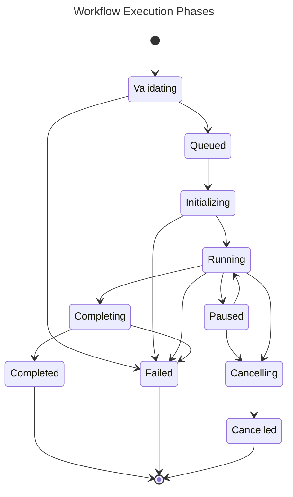

# Galaxy MCP Workflow Management

## 1. Overview

This specification defines how Galaxy workflows are represented, created, executed, and monitored through the Machine Context Protocol (MCP). It covers the translation between Galaxy workflow concepts and MCP operations, execution strategies, and state management.

## 2. Workflow Representation

### 2.1 Workflow Definition Schema

Galaxy workflows are mapped to MCP using the following schema:

```json
{
  "id": "string",
  "name": "string",
  "description": "string",
  "version": "string",
  "owner": "string",
  "tags": ["string"],
  "created": "datetime",
  "updated": "datetime",
  "steps": [
    {
      "id": "string",
      "tool_id": "string",
      "label": "string",
      "inputs": [
        {
          "name": "string",
          "type": "string",
          "source": {
            "type": "workflow_input|step_output|constant",
            "step_id": "string",
            "output_name": "string",
            "value": "any"
          }
        }
      ],
      "outputs": [
        {
          "name": "string",
          "type": "string"
        }
      ],
      "position": {
        "x": "number",
        "y": "number"
      }
    }
  ],
  "inputs": [
    {
      "name": "string",
      "label": "string",
      "type": "string",
      "optional": "boolean",
      "default": "any"
    }
  ],
  "outputs": [
    {
      "name": "string",
      "label": "string",
      "type": "string",
      "source": {
        "step_id": "string",
        "output_name": "string"
      }
    }
  ]
}
```

### 2.2 Galaxy to MCP Mapping

The following table describes how Galaxy workflow concepts map to MCP workflow concepts:

| Galaxy Concept | MCP Representation | Notes |
|----------------|-------------------|-------|
| Workflow | Workflow Definition | Includes metadata and structure |
| Step | Workflow Step | Maps to tool execution |
| Input Dataset | Workflow Input | Data entry point |
| Output Dataset | Workflow Output | Result of workflow |
| Connection | Input Source Reference | Links steps together |
| Tool | Tool Reference | References MCP tool definitions |

### 2.3 Workflow Visualization

Workflow visualization data is preserved in the MCP representation to allow for visual reconstruction of the workflow:

```json
{
  "visualization": {
    "zoom": "number",
    "pan": {
      "x": "number",
      "y": "number"
    },
    "steps": {
      "step_id": {
        "position": {
          "x": "number",
          "y": "number"
        },
        "style": {
          "color": "string",
          "shape": "string"
        }
      }
    },
    "connections": [
      {
        "source": {
          "step_id": "string",
          "output_name": "string"
        },
        "target": {
          "step_id": "string",
          "input_name": "string"
        },
        "style": {
          "color": "string",
          "line_style": "string"
        }
      }
    ]
  }
}
```

## 3. Workflow Operations

### 3.1 Core Workflow Operations

| Operation | Description | MCP Capability |
|-----------|-------------|----------------|
| List Workflows | Retrieve available workflows | `list_workflows` |
| Get Workflow | Retrieve workflow details | `get_workflow` |
| Create Workflow | Create a new workflow | `create_workflow` |
| Update Workflow | Modify an existing workflow | `update_workflow` |
| Delete Workflow | Remove a workflow | `delete_workflow` |
| Export Workflow | Export workflow definition | `export_workflow` |
| Import Workflow | Import workflow definition | `import_workflow` |

### 3.2 Workflow Execution Operations

| Operation | Description | MCP Capability |
|-----------|-------------|----------------|
| Invoke Workflow | Start workflow execution | `invoke_workflow` |
| Get Workflow Status | Check execution status | `get_workflow_status` |
| Cancel Workflow | Stop workflow execution | `cancel_workflow` |
| Resume Workflow | Resume paused workflow | `resume_workflow` |
| List Workflow Invocations | Get execution history | `list_workflow_invocations` |

### 3.3 Workflow Input Handling

MCP provides the following methods for supplying inputs to a workflow:

```json
{
  "workflow_id": "string",
  "inputs": {
    "input_name": {
      "type": "dataset|collection|parameter",
      "id": "string",
      "value": "any"
    }
  },
  "parameters": {
    "step_id": {
      "parameter_name": "value"
    }
  },
  "history_id": "string",
  "allow_tool_state_corrections": "boolean",
  "no_add_to_history": "boolean"
}
```

## 4. Workflow Execution

### 4.1 Execution Model

The Galaxy MCP integration supports two execution models:

1. **Synchronous Execution**:
   - Workflow is executed and control is returned when complete
   - Suitable for shorter workflows
   - Limited to workflows that complete within timeout period

2. **Asynchronous Execution**:
   - Workflow execution is initiated and tracked via status endpoints
   - Required for longer-running workflows
   - Supports progress monitoring and cancellation

### 4.2 Execution Phases

Galaxy workflow execution through MCP follows these phases:



### 4.3 Status Monitoring

Workflow status is reported with detailed information:

```json
{
  "id": "string",
  "workflow_id": "string",
  "state": "validating|queued|initializing|running|paused|cancelling|cancelled|completing|completed|failed",
  "started": "datetime",
  "updated": "datetime",
  "finished": "datetime",
  "user_id": "string",
  "progress": {
    "percent_complete": "number",
    "steps_completed": "number",
    "steps_total": "number"
  },
  "steps": [
    {
      "id": "string",
      "order_index": "number",
      "tool_id": "string",
      "state": "pending|running|completed|failed",
      "started": "datetime",
      "finished": "datetime",
      "outputs": {
        "output_name": "dataset_id"
      },
      "errors": ["string"]
    }
  ],
  "outputs": {
    "output_name": "dataset_id"
  },
  "errors": ["string"]
}
```

## 5. Workflow Composability

### 5.1 Subworkflows

Galaxy workflows can be nested as subworkflows. In the MCP representation:

```json
{
  "id": "step_id",
  "type": "subworkflow",
  "workflow_id": "workflow_id",
  "inputs": [
    {
      "name": "subworkflow_input_name",
      "source": {
        "type": "step_output",
        "step_id": "parent_step_id",
        "output_name": "output_name"
      }
    }
  ],
  "outputs": [
    {
      "name": "output_name",
      "type": "data"
    }
  ]
}
```

### 5.2 Workflow Modules

Complex workflows can be decomposed into reusable modules:

1. **Module Definition**:
   - Self-contained workflow with defined inputs/outputs
   - Importable into other workflows
   - Versioned independently

2. **Module Reference**:
   ```json
   {
     "id": "step_id",
     "type": "module",
     "module_id": "module_id",
     "module_version": "string",
     "inputs": {},
     "outputs": {}
   }
   ```

### 5.3 Workflow Templates

Workflows can be defined as templates with placeholder values:

```json
{
  "template_parameters": [
    {
      "name": "param_name",
      "label": "Human readable label",
      "type": "string|number|boolean|select",
      "default": "any",
      "options": ["option1", "option2"],
      "description": "Parameter description"
    }
  ],
  "steps": [
    {
      "id": "step_id",
      "tool_id": "tool_id",
      "inputs": {
        "input_name": {
          "template_parameter": "param_name"
        }
      }
    }
  ]
}
```

## 6. Workflow State Management

### 6.1 Persistence

Workflow state is persisted at multiple levels:

1. **Workflow Definition**:
   - Stored in the Galaxy database
   - Cached in the MCP adapter
   - Exportable as JSON

2. **Workflow Invocation**:
   - Execution state maintained in Galaxy
   - Progress tracked by MCP adapter
   - Detailed logs preserved

3. **Output Management**:
   - Datasets stored in Galaxy
   - References maintained in workflow state
   - Accessible via dataset IDs

### 6.2 Workflow History

The MCP adapter maintains a history of workflow executions:

```json
{
  "workflow_id": "string",
  "invocations": [
    {
      "id": "string",
      "state": "string",
      "started": "datetime",
      "finished": "datetime",
      "inputs": {},
      "outputs": {},
      "user_id": "string"
    }
  ]
}
```

### 6.3 Resumability

For workflows that support resuming after failure:

1. **Checkpointing**:
   - Intermediate results are preserved
   - Step completion status is recorded
   - Input/output dataset mappings are maintained

2. **Resume Strategy**:
   - Completed steps are skipped
   - Failed steps are retried
   - Downstream dependencies are recalculated

## 7. Workflow Scheduling

### 7.1 Resource Requirements

Workflows include resource requirements that affect scheduling:

```json
{
  "steps": [
    {
      "id": "step_id",
      "resource_requirements": {
        "memory": "string", // e.g. "4G"
        "cpu": "number",
        "time": "string",   // e.g. "2h"
        "gpus": "number"
      }
    }
  ],
  "overall_requirements": {
    "total_memory": "string",
    "total_cpu": "number",
    "estimated_runtime": "string"
  }
}
```

### 7.2 Scheduling Strategies

The MCP adapter supports various scheduling strategies:

| Strategy | Description | Use Case |
|----------|-------------|----------|
| FIFO | First-in, first-out execution | Default strategy |
| Priority | Higher priority workflows first | Critical workflows |
| Fair Share | Balanced resource allocation | Multi-user environments |
| Resource-Aware | Based on resource availability | Optimizing cluster usage |

### 7.3 Workflow Priorities

Workflows can be assigned priorities that affect scheduling:

```json
{
  "priority": {
    "level": "low|normal|high|critical",
    "score": "number",
    "factors": {
      "user_role": "string",
      "project": "string",
      "deadline": "datetime"
    }
  }
}
```

## 8. Error Handling and Recovery

### 8.1 Error Types

| Error Type | Description | Recovery Strategy |
|------------|-------------|-------------------|
| Input Validation | Invalid workflow inputs | Correct inputs and retry |
| Tool Execution | Tool failure during workflow | Retry step or provide alternative |
| Resource Limits | Exceeded memory/CPU/time | Adjust resources or optimize |
| Data Transfer | Failed to transfer data between steps | Retry transfer |
| External Service | Dependency service unavailable | Wait and retry |

### 8.2 Recovery Mechanisms

The MCP adapter implements these recovery mechanisms:

1. **Automatic Retry**:
   - Configurable retry attempts for transient failures
   - Exponential backoff between attempts
   - Tool-specific retry strategies

2. **Alternative Paths**:
   - Workflow can define alternative tools
   - Fallback execution paths
   - Conditional execution based on failures

3. **Manual Intervention**:
   - Workflow can be paused on failure
   - User can modify parameters
   - Steps can be skipped or replaced

### 8.3 Error Reporting

Detailed error information is provided for debugging:

```json
{
  "error": {
    "type": "error_type",
    "message": "human readable message",
    "step_id": "failed_step_id",
    "tool_id": "tool_id",
    "timestamp": "datetime",
    "details": {
      "tool_stderr": "string",
      "exit_code": "number",
      "command_line": "string"
    },
    "suggested_actions": [
      {
        "type": "retry|skip|modify_params|abort",
        "description": "string"
      }
    ]
  }
}
```

## 9. Workflow Analysis and Optimization

### 9.1 Performance Metrics

The MCP adapter collects performance metrics for workflows:

```json
{
  "performance": {
    "total_runtime": "duration",
    "cpu_time": "duration",
    "memory_usage": {
      "peak": "bytes",
      "average": "bytes"
    },
    "io_metrics": {
      "read_bytes": "number",
      "write_bytes": "number",
      "read_ops": "number",
      "write_ops": "number"
    },
    "step_metrics": {
      "step_id": {
        "runtime": "duration",
        "cpu_efficiency": "percentage",
        "memory_usage": "bytes"
      }
    }
  }
}
```

### 9.2 Workflow Optimization

The MCP adapter provides workflow optimization suggestions:

1. **Bottleneck Identification**:
   - Longest-running steps
   - Resource-intensive operations
   - I/O bottlenecks

2. **Optimization Strategies**:
   - Parallelization opportunities
   - Resource allocation adjustments
   - Tool parameter tuning
   - Alternative tool suggestions

3. **Predictive Scheduling**:
   - Runtime prediction based on input size
   - Resource requirement forecasting
   - Optimal execution time selection

## 10. Implementation Requirements

### 10.1 Workflow Manager Interface

```rust
pub trait WorkflowManager {
    async fn list_workflows(&self, query: WorkflowQuery) -> Result<Vec<WorkflowSummary>>;
    async fn get_workflow(&self, id: &str) -> Result<WorkflowDefinition>;
    async fn create_workflow(&self, workflow: WorkflowDefinition) -> Result<WorkflowDefinition>;
    async fn update_workflow(&self, workflow: WorkflowDefinition) -> Result<WorkflowDefinition>;
    async fn delete_workflow(&self, id: &str) -> Result<()>;
    
    async fn invoke_workflow(&self, params: InvocationParams) -> Result<WorkflowInvocation>;
    async fn get_invocation_status(&self, id: &str) -> Result<InvocationStatus>;
    async fn cancel_invocation(&self, id: &str) -> Result<()>;
    async fn resume_invocation(&self, id: &str, params: ResumeParams) -> Result<InvocationStatus>;
}

pub struct GalaxyWorkflowManager {
    galaxy_client: GalaxyClient,
    workflow_cache: Cache<WorkflowDefinition>,
    invocation_tracker: InvocationTracker,
}

impl WorkflowManager for GalaxyWorkflowManager {
    // Implementation details...
}
```

### 10.2 Workflow Translator

```rust
pub trait WorkflowTranslator {
    fn galaxy_to_mcp(&self, galaxy_workflow: GalaxyWorkflow) -> Result<WorkflowDefinition>;
    fn mcp_to_galaxy(&self, mcp_workflow: WorkflowDefinition) -> Result<GalaxyWorkflow>;
    
    fn translate_inputs(&self, mcp_inputs: WorkflowInputs) -> Result<GalaxyInputs>;
    fn translate_outputs(&self, galaxy_outputs: GalaxyOutputs) -> Result<WorkflowOutputs>;
    
    fn translate_invocation_state(&self, galaxy_state: GalaxyInvocationState) -> Result<InvocationStatus>;
}

pub struct GalaxyWorkflowTranslator {
    tool_translator: ToolTranslator,
    schema_validator: SchemaValidator,
}

impl WorkflowTranslator for GalaxyWorkflowTranslator {
    // Implementation details...
}
```

### 10.3 Workflow Monitor

```rust
pub trait WorkflowMonitor {
    async fn start_monitoring(&self, invocation_id: &str) -> Result<()>;
    async fn stop_monitoring(&self, invocation_id: &str) -> Result<()>;
    
    async fn get_current_status(&self, invocation_id: &str) -> Result<InvocationStatus>;
    async fn get_step_status(&self, invocation_id: &str, step_id: &str) -> Result<StepStatus>;
    
    fn register_status_callback(&self, callback: Box<dyn Fn(InvocationStatus) -> Result<()>>);
    fn register_completion_callback(&self, callback: Box<dyn Fn(InvocationStatus) -> Result<()>>);
}

pub struct GalaxyWorkflowMonitor {
    galaxy_client: GalaxyClient,
    polling_interval: Duration,
    active_monitors: HashMap<String, MonitorHandle>,
}

impl WorkflowMonitor for GalaxyWorkflowMonitor {
    // Implementation details...
}
```

## 11. Security Considerations

### 11.1 Workflow-Specific Security

1. **Input Validation**:
   - All workflow inputs are validated
   - Schema validation for workflow definitions
   - Parameter type and range checking

2. **Privilege Separation**:
   - Workflows execute with minimum required privileges
   - Tool permissions are enforced at each step
   - Sensitive parameter handling

3. **Resource Limits**:
   - CPU/memory/time limits enforced
   - Quotas for workflow execution
   - Rate limiting for workflow operations

### 11.2 Audit Logging

For workflow operations, the following events are logged:

```json
{
  "event_type": "workflow_operation",
  "operation": "create|update|invoke|etc",
  "workflow_id": "string",
  "user_id": "string",
  "timestamp": "datetime",
  "details": {
    "workflow_name": "string",
    "invocation_id": "string",
    "parameters": {}
  }
}
```

## 12. Related Specifications

- [Galaxy MCP Integration Plan](galaxy-mcp-integration.md)
- [API Mapping Specification](api-mapping.md)
- [Security Model](security-model.md)
- [Galaxy Workflow API](https://galaxyproject.org/learn/api/#workflows)
- [MCP Protocol Specification](../mcp/protocol.md)

<version>0.1.0</version> 