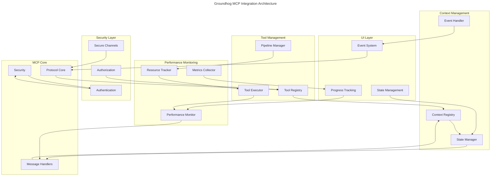
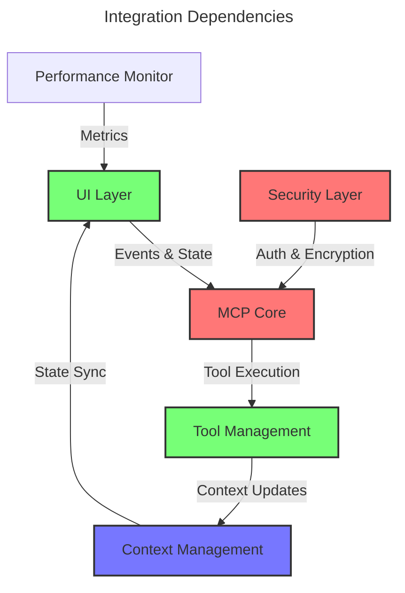
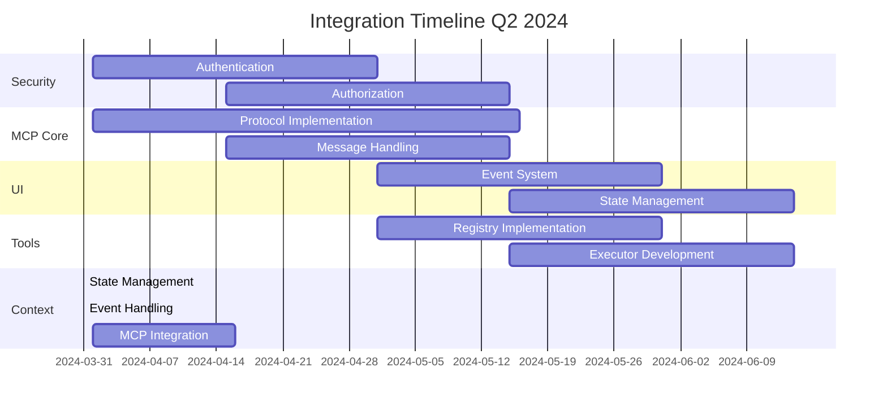
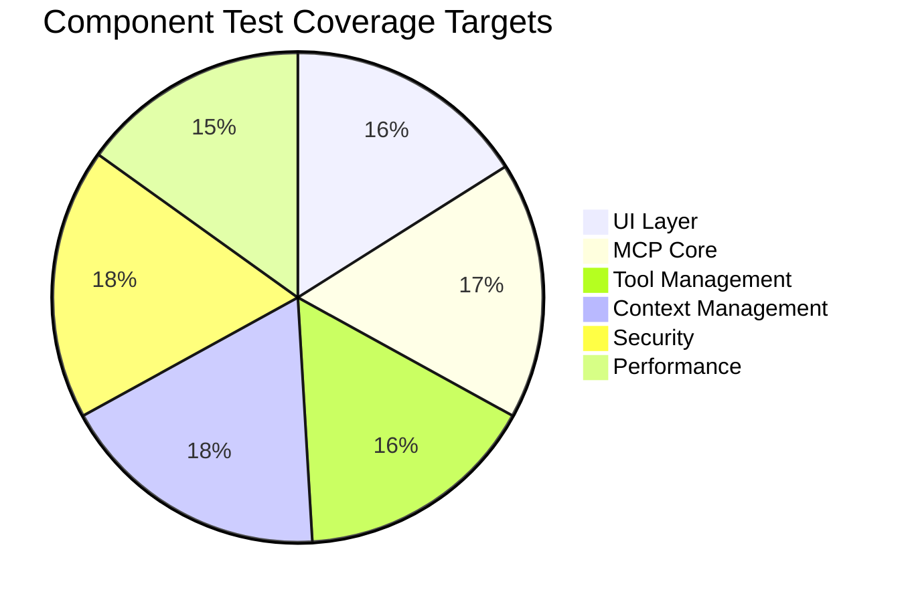

# Integration Specifications Overview

## Component Integration Map

## Integration Status Overview

| Component | Progress | Target | Priority | Status |
|-----------|----------|---------|----------|---------|
| UI-MCP Integration | 35% | Q2 2024 | High | In Progress |
| Security Integration | 20% | Q2 2024 | High | In Progress |
| Performance Integration | 25% | Q2 2024 | High | In Progress |
| Plugin Integration | 60% | Q2 2024 | High | In Progress |
| Tool Management | 35% | Q2 2024 | High | In Progress |
| Context Management | 100% | Q1 2024 | High | Completed |
| MCP Protocol Core | 45% | Q2 2024 | High | In Progress |
| Async Concurrency | 100% | Q1 2024 | High | Completed |
| MCP-Context Integration | 90% | Q2 2024 | High | Near Completion |

## Integration Patterns

The Squirrel platform implements several key integration patterns to ensure consistent component interaction:

### Core Patterns

| Pattern | Status | Description | Reference |
|---------|--------|-------------|-----------|
| Service Interface | Active | Components expose functionality through well-defined trait interfaces | [PATTERNS.md](PATTERNS.md#a-service-interface-pattern) |
| Event-Based Communication | Active | Components communicate through an event bus without direct coupling | [PATTERNS.md](PATTERNS.md#b-event-based-communication-pattern) |
| Async Concurrency | Active | Components interact safely in an async environment with proper concurrency controls | [async-concurrency-integration.md](async-concurrency-integration.md) |
| Shared State | Active | Multiple components access shared state with proper synchronization | [PATTERNS.md](PATTERNS.md#a-shared-state-pattern) |
| State Synchronization | Active | Components maintain local state that synchronizes with a central source | [PATTERNS.md](PATTERNS.md#b-state-synchronization-pattern) |
| Context-Based State | Active | Components access and update state through a managed context system | [PATTERNS.md](PATTERNS.md#c-context-based-state-pattern) |
| MCP-Context Integration | Active | Components interact with MCP through a context-aware interface | [mcp-context-integration.md](mcp-context-integration.md) |

## Cross-Component Dependencies

## Implementation Priorities

## Recent Completions

### Context Management System
- **Status**: 100% Complete
- **Completion Date**: March 31, 2024
- **Key Components**:
  - Context Registry
  - State Manager
  - Event Handler
  - Async Concurrency Patterns
  - MCP Integration (90% complete)
- **Documentation**:
  - [async-concurrency-integration.md](async-concurrency-integration.md)
  - [mcp-context-integration.md](mcp-context-integration.md)
  - [context-management-integration.md](context-management-integration.md)

### Integration Patterns
- **New Patterns**:
  - **Async Concurrency Pattern**: Provides thread-safe state management in async code
  - **MCP-Context Integration Pattern**: Connects MCP protocol with Context Management System
- **Pattern Updates**:
  - Updated PATTERNS.md to version 1.1.0
  - Added Context-Based State Pattern

## Testing Strategy

### Integration Test Coverage

### Critical Test Paths

1. UI → MCP → Tools → Context
2. Security → MCP → All Components
3. Performance → All Components
4. Context → MCP → Tools (Completed)

## Migration Guidelines

1. Version compatibility checks
2. State migration procedures
3. Protocol version updates
4. Security token updates
5. Performance baseline preservation
6. Async Code Migration:
   - Migrate from std::sync to tokio::sync
   - Follow patterns in async-concurrency-integration.md
   - Use proper lock scoping to prevent deadlocks

## Documentation Standards

All integration specifications must include:
1. Component architecture diagrams
2. Interface definitions
3. Security considerations
4. Performance requirements
5. Test coverage requirements
6. Migration procedures
7. Concurrency considerations

## Version Control

This specification is version controlled alongside the codebase.
Updates are tagged with corresponding software releases.

---

Last Updated: 2024-03-31
Version: 1.2.0 