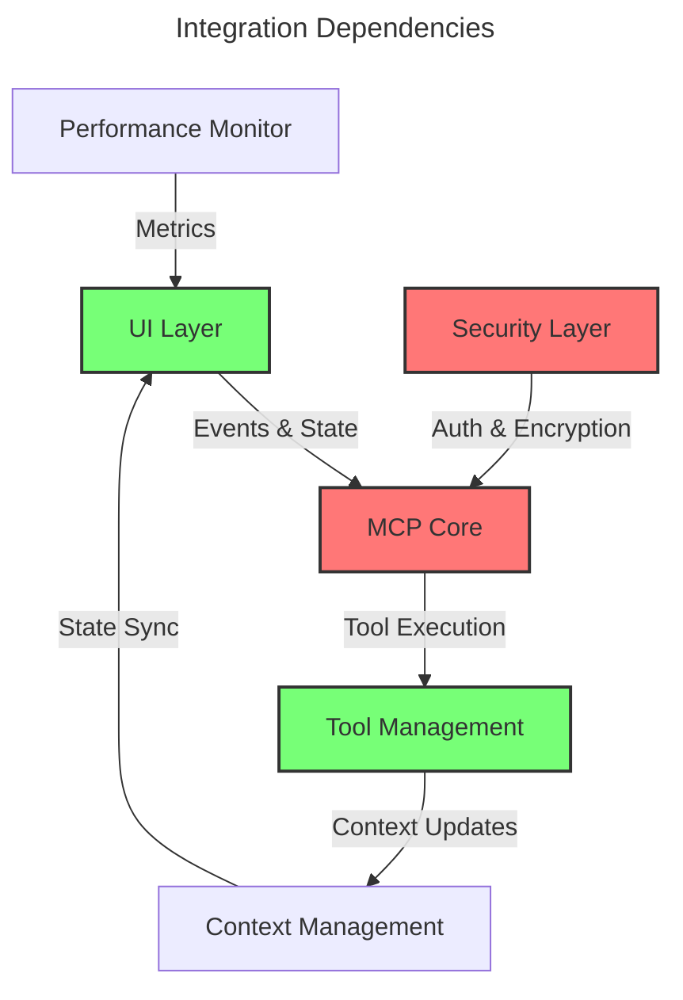
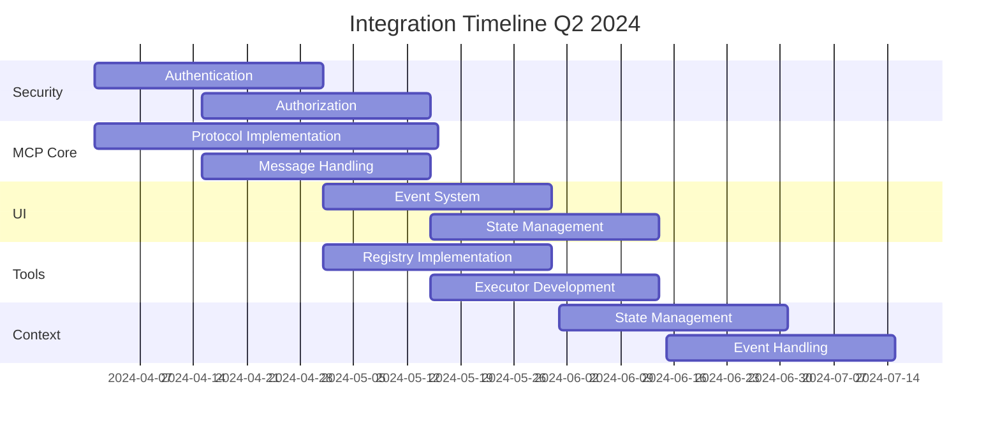
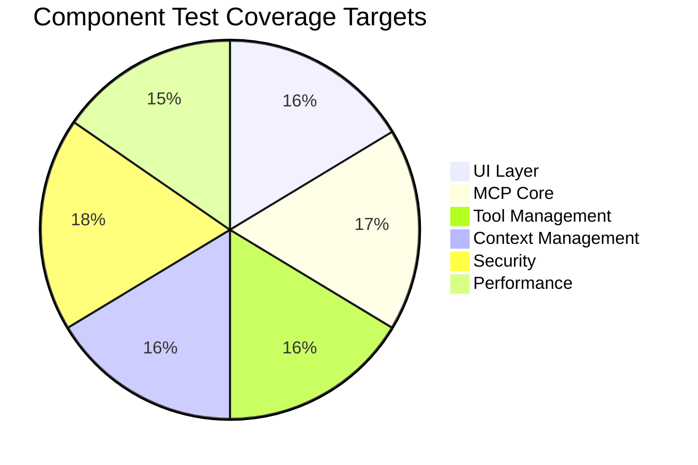

# Integration Specifications Overview

## Component Integration Map

## Integration Status Overview

| Component | Progress | Target | Priority |
|-----------|----------|---------|----------|
| UI-MCP Integration | 35% | Q2 2024 | High |
| Security Integration | 20% | Q2 2024 | High |
| Performance Integration | 25% | Q2 2024 | High |
| Plugin Integration | 30% | Q2 2024 | High |
| Tool Management | 35% | Q2 2024 | High |
| Context Management | 40% | Q2 2024 | High |
| MCP Protocol Core | 45% | Q2 2024 | High |

## Cross-Component Dependencies

## Integration Requirements Matrix

| Component | Dependencies | Security | Performance | Testing |
|-----------|--------------|----------|-------------|----------|
| UI Layer | MCP Core, Context | Auth Token | < 16ms Latency | UI Event Flow |
| MCP Core | Security, Tools | E2E Encryption | < 50ms Processing | Protocol Tests |
| Tool Management | Context, MCP | Permission Check | < 100ms Execution | Tool Lifecycle |
| Context Management | MCP, UI | State Isolation | < 50ms Sync | State Sync Tests |
| Security | All Components | - | < 10ms Auth | Security Flow |
| Performance | All Components | Metrics Security | - | Load Tests |

## Implementation Priorities

## Testing Strategy

### Integration Test Coverage

### Critical Test Paths

1. UI → MCP → Tools → Context
2. Security → MCP → All Components
3. Performance → All Components

## Migration Guidelines

1. Version compatibility checks
2. State migration procedures
3. Protocol version updates
4. Security token updates
5. Performance baseline preservation

## Documentation Standards

All integration specifications must include:
1. Component architecture diagrams
2. Interface definitions
3. Security considerations
4. Performance requirements
5. Test coverage requirements
6. Migration procedures

## Version Control

This specification is version controlled alongside the codebase.
Updates are tagged with corresponding software releases.

---

Last Updated: [Current Date]
Version: 1.1.0 