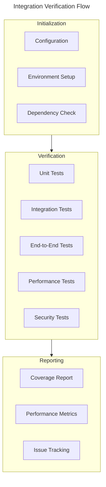
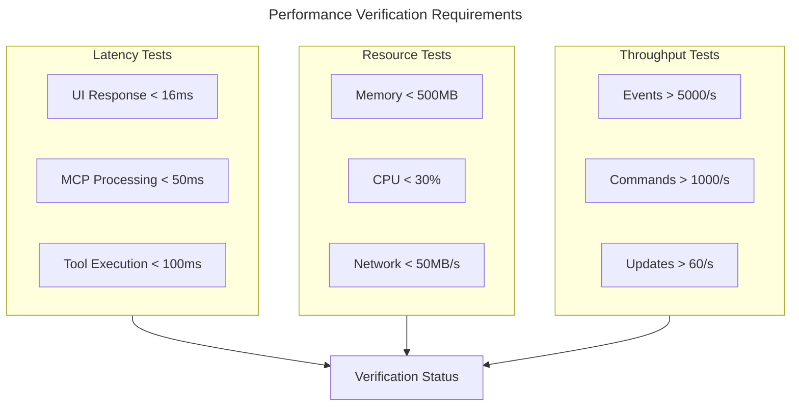
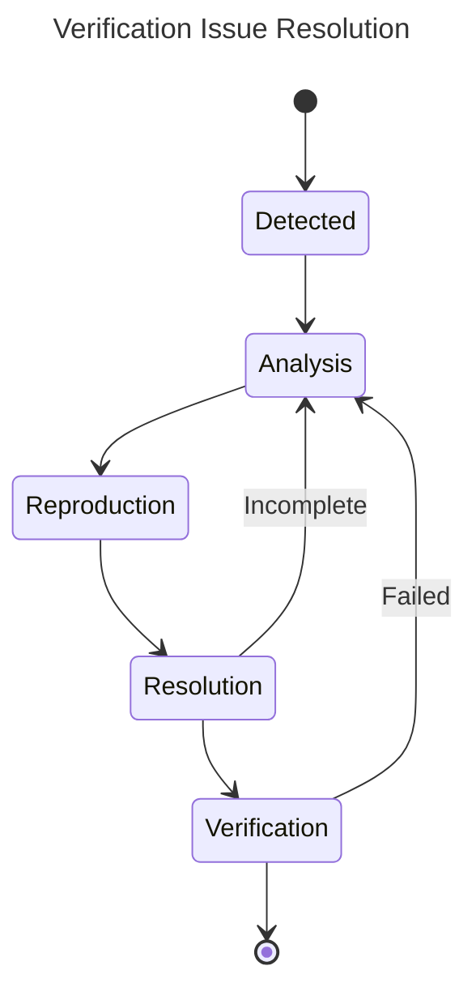

# Integration Verification Specification

## Verification Matrix



## Component Verification Requirements

### 1. UI-MCP Integration
```rust
#[tokio::test]
async fn verify_ui_mcp_integration() {
    // 1. Event System
    verify_event_flow().await?;
    
    // 2. State Management
    verify_state_sync().await?;
    
    // 3. Progress Tracking
    verify_progress_updates().await?;
}

async fn verify_event_flow() -> Result<()> {
    let metrics = measure_performance(|| {
        // Test event propagation
        // Verify handler registration
        // Check event delivery
    });
    
    assert!(metrics.latency < Duration::from_millis(16));
    assert!(metrics.success_rate > 0.999);
    Ok(())
}
```

### 2. Security Integration
```rust
#[tokio::test]
async fn verify_security_integration() {
    // 1. Authentication
    verify_auth_flow().await?;
    
    // 2. Authorization
    verify_permission_checks().await?;
    
    // 3. Secure Communication
    verify_encrypted_channels().await?;
}

async fn verify_auth_flow() -> Result<()> {
    let metrics = measure_security(|| {
        // Test token validation
        // Verify permission enforcement
        // Check audit logging
    });
    
    assert!(metrics.auth_latency < Duration::from_millis(10));
    assert!(metrics.encryption_strength >= 256);
    Ok(())
}
```

### 3. Performance Integration
```rust
#[tokio::test]
async fn verify_performance_integration() {
    // 1. Resource Monitoring
    verify_resource_tracking().await?;
    
    // 2. Metrics Collection
    verify_metrics_pipeline().await?;
    
    // 3. Alert System
    verify_alert_triggers().await?;
}

async fn verify_resource_tracking() -> Result<()> {
    let usage = measure_resources(|| {
        // Monitor memory usage
        // Track CPU utilization
        // Measure I/O operations
    });
    
    assert!(usage.memory < 500 * 1024 * 1024); // 500MB
    assert!(usage.cpu < 30.0); // 30%
    Ok(())
}
```

## Verification Procedures

### 1. Environment Setup
```rust
pub struct VerificationEnvironment {
    pub config: VerificationConfig,
    pub components: Vec<Component>,
    pub metrics: MetricsCollector,
}

impl VerificationEnvironment {
    pub async fn setup() -> Result<Self> {
        // 1. Load configuration
        let config = VerificationConfig::load()?;
        
        // 2. Initialize components
        let components = setup_components(&config).await?;
        
        // 3. Configure metrics
        let metrics = setup_metrics(&config).await?;
        
        Ok(Self {
            config,
            components,
            metrics,
        })
    }
}
```

### 2. Test Execution
```rust
pub struct TestExecutor {
    pub environment: VerificationEnvironment,
    pub results: Vec<TestResult>,
}

impl TestExecutor {
    pub async fn run_verification(&mut self) -> Result<TestReport> {
        // 1. Run unit tests
        self.run_unit_tests().await?;
        
        // 2. Run integration tests
        self.run_integration_tests().await?;
        
        // 3. Run performance tests
        self.run_performance_tests().await?;
        
        // 4. Generate report
        Ok(self.generate_report())
    }
}
```

## Test Coverage Matrix

| Component | Unit Tests | Integration Tests | E2E Tests | Performance Tests | Security Tests |
|-----------|------------|------------------|-----------|-------------------|----------------|
| UI Layer | 90% | 85% | 80% | Required | Optional |
| MCP Core | 95% | 90% | 85% | Required | Required |
| Security | 95% | 90% | 85% | Required | Required |
| Tools | 90% | 85% | 80% | Required | Required |
| Context | 90% | 85% | 80% | Required | Optional |

## Performance Verification Matrix



## Security Verification Matrix

### 1. Authentication Tests
- Token validation
- Session management
- Multi-factor authentication
- Password security
- Token refresh flow

### 2. Authorization Tests
- Permission checks
- Role management
- Resource access
- Action validation
- Audit logging

### 3. Communication Tests
- Encryption verification
- Channel security
- Message integrity
- Replay protection
- Protocol security

## Issue Resolution Process



## Reporting Requirements

### 1. Test Reports
- Test execution summary
- Coverage metrics
- Performance results
- Security audit results
- Issue tracking status

### 2. Metrics Collection
- Response time percentiles
- Resource utilization
- Error rates
- Security incidents
- Performance bottlenecks

## Version Control

This specification is version controlled alongside the codebase.
Updates are tagged with corresponding software releases.

---

Last Updated: [Current Date]
Version: 1.1.0 