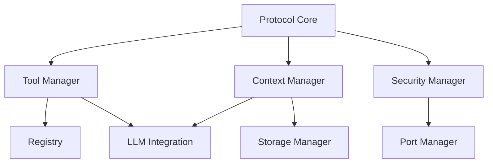

# MCP MVP Technical Specification

## Overview
This document outlines the technical requirements and implementation plan for the Minimum Viable Product (MVP) of the Machine Context Protocol (MCP) system.

## Core Components Priority

### 1. Protocol Core (80% Complete)
```rust
pub trait MCPProtocol {
    fn handle_message(&mut self, message: Message) -> Result<Response, ProtocolError>;
    fn create_message(&self, kind: MessageKind, payload: Payload) -> Message;
    fn validate_message(&self, message: &Message) -> Result<(), ValidationError>;
}

#[derive(Debug, Clone)]
pub struct Message {
    pub id: MessageId,
    pub kind: MessageKind,
    pub payload: Payload,
    pub metadata: MessageMetadata,
}
```

#### MVP Requirements
- Complete message format implementation
- Implement core message handlers
- Add basic validation
- Implement error recovery
- Add message routing

### 2. Tool Management (60% Complete)
```rust
pub trait ToolManager {
    fn register_tool(&mut self, tool: Box<dyn Tool>) -> Result<ToolId, RegistrationError>;
    fn execute_tool(&mut self, id: ToolId, args: ToolArgs) -> Result<ToolOutput, ExecutionError>;
    fn list_tools(&self) -> Vec<ToolInfo>;
}

pub trait Tool: Send + Sync {
    fn execute(&mut self, args: ToolArgs) -> Result<ToolOutput, ToolError>;
    fn get_capabilities(&self) -> Vec<Capability>;
    fn cleanup(&mut self) -> Result<(), CleanupError>;
}
```

#### MVP Requirements
- Complete tool registration system
- Implement basic lifecycle management
- Add capability discovery
- Implement tool execution pipeline

### 3. Context Management (45% Complete)
```rust
pub trait ContextManager {
    fn create_context(&mut self) -> Result<ContextId, ContextError>;
    fn update_context(&mut self, id: ContextId, data: ContextData) -> Result<(), UpdateError>;
    fn get_context(&self, id: ContextId) -> Option<&Context>;
    fn delete_context(&mut self, id: ContextId) -> Result<(), DeletionError>;
}

#[derive(Debug, Clone)]
pub struct Context {
    pub id: ContextId,
    pub data: ContextData,
    pub metadata: ContextMetadata,
}
```

#### MVP Requirements
- Implement core context tracking
- Add basic state synchronization
- Develop persistence layer
- Add context validation

### 4. Security and Port Management (40% Complete)
```rust
pub trait SecurityManager {
    fn authenticate(&mut self, credentials: Credentials) -> Result<AuthToken, AuthError>;
    fn authorize(&self, token: &AuthToken, action: Action) -> Result<(), AuthError>;
    fn validate_request(&self, request: &Request) -> Result<(), ValidationError>;
}

pub trait PortManager {
    fn allocate_port(&mut self) -> Result<u16, PortError>;
    fn release_port(&mut self, port: u16) -> Result<(), PortError>;
    fn is_port_available(&self, port: u16) -> bool;
}
```

#### MVP Requirements
- Implement basic authentication
- Add port allocation system
- Develop security validation
- Add request validation

## Implementation Timeline

### Phase 1 (Weeks 1-2)
1. Protocol Core
   - Complete message format
   - Implement handlers
   - Add validation

2. Tool Manager
   - Complete registration
   - Add execution pipeline
   - Implement lifecycle

3. Context Manager
   - Core context tracking
   - Basic state sync
   - Initial persistence

### Phase 2 (Weeks 3-4)
1. Security
   - Basic authentication
   - Request validation
   - Port allocation

2. Port Management
   - Port allocation
   - Port validation
   - Resource cleanup

3. Registry
   - Tool discovery
   - Capability matching
   - Registration API

### Phase 3 (Weeks 5-6)
1. LLM Integration
   - System prompts
   - Context handling
   - Response processing

2. Error Handler
   - Recovery strategies
   - Error propagation
   - Logging integration

3. Basic Monitoring
   - Health checks
   - Metrics collection
   - Status reporting

## Technical Dependencies



## Success Criteria

### Phase 1
- [ ] Protocol message handling complete
- [ ] Tool registration working
- [ ] Basic context management functional
- [ ] Core tests passing

### Phase 2
- [ ] Security validation implemented
- [ ] Port management working
- [ ] Registry system operational
- [ ] Integration tests passing

### Phase 3
- [ ] LLM integration complete
- [ ] Error handling working
- [ ] Basic monitoring operational
- [ ] System tests passing

## Next Steps
1. Complete Protocol Core implementation
2. Implement Tool Manager registration
3. Develop Context Management system
4. Add Security validation
5. Implement Port Management
6. Complete Registry system

## Technical Notes
- Use async/await for all I/O operations
- Implement proper error handling
- Add comprehensive logging
- Include metrics collection
- Write unit tests for all components
- Add integration tests for system
- Document all public APIs
- Follow Rust best practices 