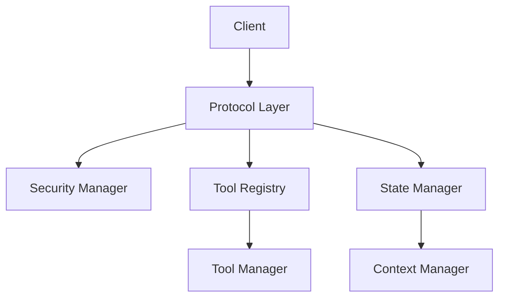

# Machine Context Protocol (MCP) System Overview

## System Architecture

The MCP system is divided into two main subsystems:

### 1. Core MCP (Protocol Layer)
Handles the fundamental communication and security infrastructure:

- **Protocol Management** (`protocol.md`)
  - Message transport
  - Protocol versioning
  - Connection handling
  - Error management

- **Security** (`security-manager.md`)
  - Authentication
  - Authorization
  - Session management
  - RBAC implementation

- **Registry** (`registry.md`)
  - Tool registration
  - Capability management
  - Service discovery

- **Tool Management** (`tool-manager.md`)
  - Tool lifecycle
  - Execution environment
  - Resource management

### 2. Context Management System
Handles state and context management across the development environment:

- **State Management** (`state-manager.md`)
  - Application state
  - State transitions
  - State recovery
  - Persistence

- **Context Management**
  - Workspace context
  - User context
  - Tool context
  - Context synchronization

## System Interaction

## Responsibilities

### MCP Core
- Protocol implementation
- Security enforcement
- Tool registration and execution
- Message routing
- Error handling
- Connection management

### Context Management
- State persistence
- Context synchronization
- Workspace management
- User state management
- Recovery mechanisms
- State validation

## Implementation Guidelines

### 1. Separation of Concerns
- Keep protocol logic separate from context management
- Use clear interfaces between subsystems
- Maintain independent versioning
- Document cross-system dependencies

### 2. Security Integration
- Implement security at protocol level
- Enforce context-aware security policies
- Validate state transitions
- Audit critical operations

### 3. Error Handling
- Define clear error boundaries
- Implement proper recovery mechanisms
- Log errors appropriately
- Maintain system stability

## Future Considerations

### 1. Scalability
- Support for distributed systems
- Multi-user environments
- High availability requirements
- Performance optimization

### 2. Extensibility
- Plugin architecture
- Custom tool support
- Protocol extensions
- Context customization

### 3. Integration
- IDE integration
- CI/CD pipeline support
- External tool integration
- Analytics and monitoring

## Best Practices

1. **Protocol Development**
   - Follow versioning guidelines
   - Maintain backward compatibility
   - Document message formats
   - Test protocol changes

2. **Context Management**
   - Implement proper state validation
   - Maintain data integrity
   - Support recovery mechanisms
   - Document state transitions

3. **Security**
   - Follow security best practices
   - Implement proper authentication
   - Maintain secure sessions
   - Log security events

4. **Tool Integration**
   - Validate tool registration
   - Manage tool lifecycle
   - Monitor resource usage
   - Handle tool errors

## Version History

- 1.0.0: Initial system overview
  - Separated MCP core from Context Management
  - Defined system boundaries
  - Established interaction patterns
  - Documented best practices

<version>1.0.0</version> 